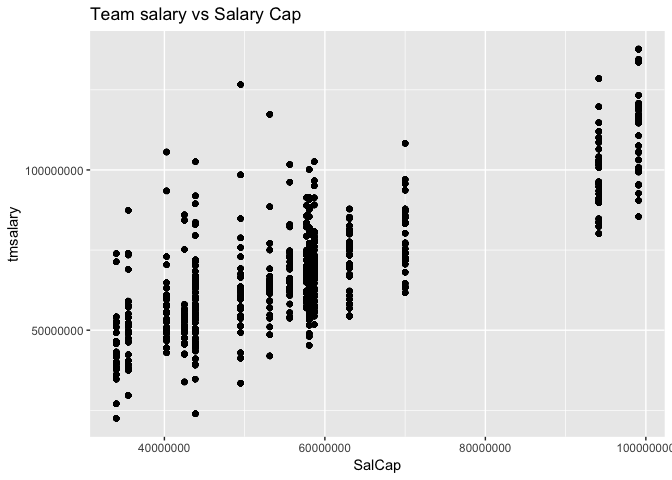
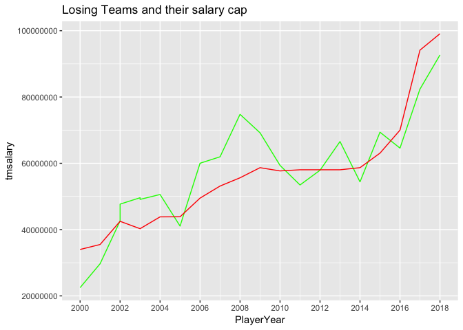

###**Introduction**

Moneyball a book by Michael Lewis was a story about the Oakland Athletics a team that was limited to a small budget and was able to achieve success in Major League Baseball by using team analytics to choose the right players that could produce a successful regular season.  Many NBA teams nowadays use team, player and game analytics to try to find an advantage in a competitive basketball league.  As a general manager, scout, owner and even avid fan the quest to put together the perfect team that remains relatively close to the salary cap is the goal for the regular season.  Ultimately choosing the right players to put together a championship dynasty is the goal for every city that has a NBA team.  

**What we are trying to solve and explore:**

Therefore the question that we are trying to solve is, whether Moneyball will work in the NBA for a regular season like it did for the Oakland Athletics and can we identify trends and build upon these findings. 

The goal is to make better informed decisions in salary contract talks as well as scouting in the free agency market.  Unlike baseball the NBA has a soft cap which will allow teams to have exceptions and be able to spend money on players even though they are past the salary cap.  A most recent notable signing is Demarcus Cousins for the Golden State Warriors.  (He was signed using the mid-level exception for the 2018-2019 season.) 

###**Data Wrangling and Cleaning**

The data was collected from the following sources. 

  [BasketBall Reference](https://www.basketball-reference.com)

  [Hoops Hype](https://hoopshype.com)

  [NBA STATs](https://stats.nba.com)

  [Patricia Bender](https://www.eskimo.com/~pbender/)

  [Land of Basketball](https://www.landofbasketball.com)

  [CBA Agreements](http://www.cbafaq.com/salarycap.htm)

The hoops hype data contained the salary data for NBA players from 2001-2019.  The 2000 salary data was collected from Particia benders website.  Salary data collection was collected by using rvest to web scrap the table from the two websites.  


```r
salary_2018 <- read_html("https://hoopshype.com/salaries/players/2017-2018/") %>%
  html_nodes("table") %>%  html_table
```

Salary data was checked by looking a business insider article which took a look at some of the top paid players in the NBA. 

College, age and weight data was collected through NBA stats and loaded through a csv file.
NBA player statistics was collected through Basketball reference.  The website provided csv files for player statistics.

Land of Basketball provided data on award and number of team wins.  

The NBA collective bargaining agreement and sample contract of NBA players provided insights on the structure of NBA contracts.

The following packages were used to clean the data.


```r
library(dplyr)
library(ggplot2)
library(tidyr)
library(stringr)
library(data.table)
library(ggrepel)
library(directlabels)
library(gridExtra)
options(max.print = 999999999)
options(scipen=12)
```

**Initial Data cleaning**

The data for the 2000 to 2019 data was cleaned year by year since there were many unique names for each season which required me to search for the name using grepl and changing it.  The data was extremely raw and using different sources yielded different spellings of players and teams.  

The first step was to remove unnecessary columns that weren’t going to be used.  We sure to change the column name for the players names to names for before doing a full join. 


```r
# clean up stats
#remove rank column 
stat <- stat[,-c(1,5)]
#Seperate player and player id 
stat <- stat %>% separate(Player, c("player_name", "player_id"),"\\\\")
##Clean up to remove . from stat_2018
grep("\\.", stat$player_name, value = TRUE)
stat$player_name<- gsub("\\.", "", stat$player_name)
grep("\\.", stat$player_name, value = TRUE)
names(stat)
stat$Age <- as.numeric(stat$Age)
colnames(stat)[30] <- "ppg"
##Clean up salary 
salary <- salary[,-c(3)]
#salary <- salary[-1,]
colnames(salary) <- c("player_name", "salary")
rownames(salary) <- NULL
grep("\\.",salary$player_name)
grep(".Jr$", salary$player_name, value = TRUE) # 3 Jrs 
#remove columns from age data 
age <- age[,-c(3,11:14,16:20)]
#remove rows that have Player 
y<-which(age$PLAYER == "PLAYER")
age <- age[-c(y),]
#Change PLAYER to player_name 
names(age)[1]<-paste("player_name") 
```

Had to clean the data to remove all “-“, “*”, “,” from the name columns.  Also, had to add in JR or III for data sources like Basketball reference that removes the suffix. 

Used grepl and gsub to accomplish this.  


```r
#getting rid of periods in name 
grep("\\*",age$player_name, value = T)
grep("\\*",stat$player_name, value = T)
stat$player_name <- gsub("\\*","",stat$player_name)
grep("Ray Allen",stat$player_name, value =T)
grep("\\*",salary$player_name, value = T)
grep("\\.",age$player_name)
age$player_name <- gsub("\\.","", age$player_name)
grep(".Jr$", age$player_name, value = TRUE) # 6 Jrs here.  
grep("Glen Rice", age$player_name, value = TRUE)
grep(".Jr$",stat$player_name, value = TRUE) 
#look through all stats for which one junior is missing for a total of 13 was missing in stats. 
grep(".Jr$", salary$player_name, value = TRUE)
##### Filling all the juniors 
#stat
grep("Roger Mason",stat$player_name, value = TRUE)
stat$player_name<-gsub("Roger Mason", "Roger Mason Jr", stat$player_name)
#testing salary 
grep("Roger Mason",salary$player_name, value = TRUE)
salary$player_name<-gsub("Roger Mason", "Roger Mason Jr", salary$player_name)
#-------------------------
```


There were also, weird name spellings like Nene Hilario that was spelled as Nene, or other international players who had their country passport name instead of their NBA USA player name.  For example Hedo Turkoglu as Hidayet Turkloglu.  Changed all basketball player names to their USA player names.  As well as changed Ron Artests name to Metta World Peace. 

This was accomplished by using gusb and grepl as well as which.


```r
#nene hilario weird spelling 
grep("^Ne", stat$player_name, value = TRUE)
grep("^Nene", age$player_name, value = TRUE) # located in age 
grep("^Ne", age$player_name)
age$player_name <- gsub("Nene", "Nene Hilario", age$player_name) 
grep("^Nen", salary$player_name, value = TRUE)
salary$player_name <- gsub("Nenê", "Nene Hilario", salary$player_name)
```

There were some issues with duplicate names as well due to player movement for that year.  Removed the duplicated names and categorized the player into the last team he played for that season.  
This was accomplished using which, duplicated and the dplyer package using the pipe operator to group_by and filter. 


```r
#multiple trade scenarios where a player ended up on different teams 
which(duplicated(stat$player_name))
sum(duplicated(stat$player_name))
stat %>% group_by(player_name) %>% filter(n() > 1)
a<-which(duplicated(stat$player_name))
#Will use last team played for when doing full join so remove duplicates 
stat<- stat[-c(a),]
rownames(stat) <- NULL 
```

After performing a full join which was joined by the players name, fixed the problem of height which was loaded in as a date instead of feet and inches.

Used grepl and gsub to change this. 


```r
#time to combine all of them 
data <- full_join(salary, age, by = "player_name")
data <- full_join(data, stat, by = "player_name")

#have to fill in the N/As now.  
colnames(data)[2] <- "salary"
colnames(data)[39] <- "ppg"
sum(is.na(data$salary)) 
which(is.na(data$salary))
sum(is.na(data$TEAM)) 
sum(is.na(data$ppg)) 

#find duplicated rows
which(duplicated(data$player_name))

#change the height data so it's not in date format 
data$HEIGHT <- gsub("Jun", "6", data$HEIGHT, fixed=TRUE)
data$HEIGHT <- gsub("Jul", "7", data$HEIGHT, fixed=TRUE)
data$HEIGHT <- gsub("May", "5", data$HEIGHT, fixed=TRUE)


data$HEIGHT[which(data$HEIGHT == "11-6")] = '6-11"'
data$HEIGHT[which(data$HEIGHT == "10-6")] = '6-10"'
data$HEIGHT[which(data$HEIGHT == "9-6")] = '6-9"'
data$HEIGHT[which(data$HEIGHT == "8-6")] = '6-8"'
data$HEIGHT[which(data$HEIGHT == "7-6")] = '6-7"'
data$HEIGHT[which(data$HEIGHT == "5-6")] = '6-5"'
data$HEIGHT[which(data$HEIGHT == "4-6")] = '6-4"'
data$HEIGHT[which(data$HEIGHT == "3-6")] = '6-3"'
data$HEIGHT[which(data$HEIGHT == "2-6")] = '6-2"'
data$HEIGHT[which(data$HEIGHT == "1-6")] = '6-1"'
data$HEIGHT[which(data$HEIGHT == "6-00")] = '6-0"'
data$HEIGHT[which(data$HEIGHT == "11-5")] = '5-11"'
data$HEIGHT[which(data$HEIGHT == "10-5")] = '5-10"'
data$HEIGHT[which(data$HEIGHT == "9-5")] = '5-9"'
data$HEIGHT[which(data$HEIGHT == "8-5")] = '5-8"'
data$HEIGHT[which(data$HEIGHT == "7-5")] = '5-7"'
data$HEIGHT[which(data$HEIGHT == "1-7")] = '7-1"'
data$HEIGHT[which(data$HEIGHT == "2-7")] = '7-2"'
data$HEIGHT[which(data$HEIGHT == "3-7")] = '7-3"'
data$HEIGHT[which(data$HEIGHT == "7-00")] = '7-0"'
data$HEIGHT[which(data$HEIGHT == "6'6")] = "6'6\""

#change the symbols - to 4'2"
data$HEIGHT <- gsub("-", "'", data$HEIGHT, fixed=TRUE)
grep("[I]", data$player_name, value = TRUE)

#--------------------------#
```

There were several NAs in the rows so created another CSV file to load in the missing data.  Information for the missing player statistics was loaded from basketball reference again and for the salary was loaded from Patricia Bender’s data archive.  

Used whichis.na 


```r
miss_sal<-read.csv("missing_salary_2000.csv", header = F)

colnames(miss_sal)[1:39] <- c("player_name", "salary", "TEAM",  "HEIGHT", "WEIGHT", "COLLEGE", "COUNTRY", "DRAFT.YEAR",
                              "DRAFT.ROUND", "DRAFT.NUMBER", "NETRTG", "player_id", "Pos", "Age", "G", "GS", "MP", "FG", "FGA",
                              "FG.", "X3P", "X3PA", "X3P.", "X2P", "X2PA", "X2P.", "eFG.", "FT", "FTA", "FT.", "ORB", "DRB",
                              "TRB", "AST", "STL", "BLK", "TOV", "PF", "ppg") 
x<-which(is.na(data$salary))
data <- data[-c(x),]
data<-rbind(data,miss_sal)
```

The stringr package was used to format the salary column and convert it to a numeric.  Inflation data was loaded in using a full_join. 


```r
#Making salary into numeric 
data$salary <- str_replace(data$salary, "\\$", "")
data$salary <- str_replace_all(data$salary, ",", "")
data$salary <- as.numeric(data$salary)
rownames(data) <- NULL 
```

Then filled in the awards section for most valuable player, All NBA team, defensive player of the year, sixth man, rookie of the year, all defensive team from land of basketball. 


```r
# make a column if they won the awards the previous year.  #make columns for awards
test <- data
test["MVP"] <- "NO"
test["MIP"] <- "NO"
test["Sixth_man"] <- "NO"
test["DPOY"] <- "NO"
test["ROY"] <- "NO"
test["NBA_1"] <- "NO"
test["NBA_2"] <- "NO"
test["NBA_3"] <- "NO"
test["Rookie_1"] <- "NO"
test["Rookie_2"] <- "NO"
test["Def_1"] <- "NO"
test["Def_2"] <- "NO"

#Nba first team

a1<-grep("Tim Duncan", test$player_name)
test[a1, 48] <- "YES"
a2<-grep("Karl Malone", test$player_name)
test[a2, 48] <- "YES" 
a3<-grep("Allen Iverson", test$player_name)
test[a3, 48] <- "YES"
a4<-grep("Jason Kidd", test$player_name)
test[a4,48] <- "YES"
a5<-grep("Alonzo Mourning", test$player_name)
test[a5, 48] <- "YES" 
```


This process was then repeated going through the 2000 to 2019 NBA season. 

Rbind was used to bind all the seasons together. Then the data columns were renamed.  


```r
data_2018<-read.csv("2018_data.csv")
data_2017<-read.csv("2017_data.csv")
data_2016<-read.csv("2016_data.csv")
data_2015<-read.csv("2015_data.csv")
data_2014<-read.csv("2014_data.csv")
data_2013<-read.csv("2013_data.csv")
data_2012<-read.csv("2012_data.csv")
data_2011<-read.csv("2011_data.csv")
data_2010<-read.csv("2010_data.csv")
data_2009<-read.csv("2009_data.csv")
data_2008<-read.csv("2008_data.csv")
data_2007<-read.csv("2007_data.csv")
data_2006<-read.csv("2006_data.csv")
data_2005<-read.csv("2005_data.csv")
data_2004<-read.csv("2004_data.csv")
data_2003<-read.csv("2003_data.csv")
data_2002<-read.csv("2002_data.csv")
data_2001<-read.csv("2001_data.csv")
data_2000<-read.csv("2000_data.csv")


data<-rbind(data_2019,data_2018,data_2017,data_2016,data_2015,data_2014,data_2013,data_2012,data_2011,data_2010, data_2009,
            data_2008, data_2007, data_2006, data_2005, data_2004, data_2003, data_2002, data_2001, data_2000)
#Error in match.names(clabs, names(xi)) : 
#names do not match previous names
colnames(data_2019) == colnames(data_2000)
names(data)
```

###**Data Cleaning after initial Data exploration:** 

We ended up having 9015 observations.  However, I decided to remove the 2019 data set since the season was still going on and I did not want to include an incomplete season with the rest of the data.  

Also, ran a check for players who were injured, waived or released.  Salaries would still be included on the team due to contractual obligations.  (The league included stretch provisions where teams could stretch out the payment of a contract over several years this would allow teams some salary cap relief.) 

Removed players who did not even attempt a single 2-point field goal.  Also removed players who were not able to play more than 5 minutes per game.  This reduced the number of observations to 7978. The reason why I removed the data was because I wanted to include players who played meaningful minutes on average and players who at least attempted a 2 point shot.  


```r
lessthanfive<-which(df$Games <5)
df <- df[-lessthanfive,]
lessthanfiveminGame <- which(df$MinGames < 5)
df <- df[-lessthanfiveminGame,]
lessthanoneppg<-which(df$ppg < 1)
df <- df[-lessthanoneppg,]
#decided not to use the incomplete 2019 dataset
twennineteen<-which(df$PlayerYear == 2019)
df <- df[-twennineteen,]
rownames(df) <- NULL 
```

In the time period from 2000 to 2018, the Vancouver Grizzlies became the Memphis Grizzlies, the Seattle Supersonics became the Oklahoma City Thunder, the New Jersey Nets became the Brooklyn Nets, the Charlotte Hornets became the New Orleans Pelicans, Charlotte under the leadership of Michael Jordan got their team back and got their team back but were named the Bobcats before switching the name back to the Hornets. 

	I chose to change the old team names to the newer one.  I used grepl and gsub to perform this task. For example from 2000 to 2007 the Seattle Supersonics team would be changed to the Oklahoma City Thunder. While, this is inaccurate it won’t affect the players data and stats but it will keep track of team win history through 2000 to 2018.  
	

```r
#checking team names 
unique(df$team)
grepl("PHX", df$team)
grepl("PHO", df$team)
which(df$team == "PHO")
df$team <- gsub("PHX", "PHO", df$team)

#vancouver grizzlies were 2000 and 2001, 
df$team <- gsub("VAN", "MEM", df$team)
#Sonics was from 2008 to 2018, 
df$team <-gsub("SEA", "OKC", df$team)
#Nets moved to brooklyn in 2011
df$team <-gsub("NJN", "BRK", df$team)
df$team <-gsub("BKN", "BRK", df$team)
#Charlotte hornets 2000- 2002 then became the bobcats and got name back to be hornets again in 2014
which(df$team == "CHH") #charlote hornets
df[6817,]
df$team <-gsub("CHA", "CHO", df$team)
df$team <-gsub("CHH", "CHO", df$team)
#New Orlean Pelicans 
which(df$team == "NOK")
df[4790,] # is the hornets for new orleans 

df$team <-gsub("NOH", "NOP", df$team)
df$team <-gsub("NOK", "NOP", df$team)
unique(df$team)
```

**Data Sources each with their own unique spelling for names and team symbols.**  

Some of the sources used different symbols for different teams.  For example, the Charlotte Hornets would be shortened to CHA on one site, CHH on another source and CHO on another.  The Phoenix Suns also had a similar problem where the teams symbol would be PHO and PHX.

I chose CHO for Charlotte and PHO for Phoenix.  I used which, gsub, grepl and unique. 

The Charlotte Hornets data set refused to load in.  Ended up using data.table package to input the data for the number of wins. 
 

```r
setDT(data)
data[i = PlayerYear == 2018 & team == "CHO", 
     j = TeamWins := 36]
data[i = PlayerYear == 2017 & team == "CHO", 
     j = TeamWins := 36]
```

Changed height from feet and inches to centimeters so I will be able to do a correlation analysis for height and salary.    


```r
#want to change height to cm to calculate average joe data
df$height_ft<-gsub("7'6\"", 229, df$height_ft)
df$height_ft<-gsub("7'5\"", 226, df$height_ft)
df$height_ft<-gsub("7'4\"", 224, df$height_ft)
df$height_ft<-gsub("7'3\"", 221, df$height_ft)
df$height_ft<-gsub("7'2\"", 219, df$height_ft)
df$height_ft<-gsub("7'1\"", 216, df$height_ft)
df$height_ft<-gsub("7'0\"", 214, df$height_ft)
df$height_ft<-gsub("6'11\"", 211, df$height_ft)
df$height_ft<-gsub("6'10\"", 208, df$height_ft)
df$height_ft<-gsub("6'9\"", 206, df$height_ft)
df$height_ft<-gsub("6'8\"", 203, df$height_ft)
df$height_ft<-gsub("6'7\"", 201, df$height_ft)
df$height_ft<-gsub("6'6\"", 198, df$height_ft)
df$height_ft<-gsub("6'6", 198, df$height_ft)
df$height_ft<-gsub("6'5\"", 196, df$height_ft)
df$height_ft<-gsub("6'4\"", 193, df$height_ft)
df$height_ft<-gsub("6'3\"", 191, df$height_ft)
df$height_ft<-gsub("6'2\"", 188, df$height_ft)
df$height_ft<-gsub("6'1\"", 186, df$height_ft)
df$height_ft<-gsub("6'0\"", 183, df$height_ft)
df$height_ft<-gsub("5'11\"", 180, df$height_ft)
df$height_ft<-gsub("5'10\"", 178, df$height_ft)
df$height_ft<-gsub("5'9\"", 175, df$height_ft)
df$height_ft<-gsub("5'8\"", 173, df$height_ft)
df$height_ft<-gsub("5'7\"", 170, df$height_ft)
df$height_ft<-gsub("5'6\"", 168, df$height_ft)
df$height_ft<-gsub("5'5\"", 165, df$height_ft)
df$height_ft<-gsub("5'4\"", 163, df$height_ft)
df$height_ft<-gsub("5'3\"", 160, df$height_ft)
df <-df[,-c(1:2)]
colnames(df)[4] <- "height_cm"
str(df)
df$height_cm <- as.numeric(df$height_cm)
height_na<-which(is.na(df$height_cm))
```

**Additional Variables added from the initial Data Wrangling Process**

Number of years in the NBA 
Reason this was added in, is because the number of years played under the collective bargaining agreement awards players higher available salary for the more years they played in the league.  The minimum for a player who played 1 year will be vastly different than a player who’s played 10 years and is getting the minimum from the team. (Under the current NBA CBA a 1 year minimum salary player could only receive 1,349,383 dollars and this contract could only be extended for 2 years while a 10 year player would receive 2,393,887 dollars the first year and this contract could be extended for up to 5 years.  

**Team Salary, Salary Cap,  Over/Under**

These 3 variables were added to compare the change of team salary and salary cap over the years and how much the team was over and under the cap.  


```r
#load in team salary want to see how much each player salary takes from total team salary 
#see if they are worth it. #2004 changed to 30 teams 
tmSal_18<-read.csv("hoops_hype_salaryt_2018.csv",header = F)
tmSal_18 <- tmSal_18[-c(1:2),-c(1:2,5)]
tmSal_18["PlayerYear"] <- 2018 
colnames(tmSal_18)[1:2]<- c("team","tmsalary")
rownames(tmSal_18) <- NULL 

tmSal <- rbind(tmSal_00,tmSal_01, tmSal_02, tmSal_03, tmSal_04, tmSal_05,
               tmSal_06, tmSal_07, tmSal_08, tmSal_09, tmSal_10,
               tmSal_11, tmSal_12, tmSal_13, tmSal_14, tmSal_15,
               tmSal_16, tmSal_17, tmSal_18)

tmSal$team<-gsub("LA Clippers", "LAC", tmSal$team)
tmSal$team<-gsub("Vancouver Grizzlies", "MEM", tmSal$team)
tmSal$team<-gsub("Memphis", "MEM", tmSal$team)
tmSal$team<-gsub("Seattle Sonics", "OKC", tmSal$team)
tmSal$team<-gsub("Oklahoma City", "OKC", tmSal$team)
tmSal$team<-gsub("Charlotte Hornets", "CHO", tmSal$team)
tmSal$team<-gsub("Charlotte", "CHO", tmSal$team)
tmSal$team<-gsub("New Orleans", "NOP", tmSal$team)
```


I ended up removing state taxes from the data.  The reason why is because this information would require advice from a tax specialist.  Each state has their own different structure for tax brackets depending on the players income.  Jock tax also applies to the NBA.  Jock tax is where a player would be taxed in the city they played in.  For example, there are 82 games in one season.  41 of those games would be taxed in the city the player signed with while the other 41 games would be taxed according to where the player played for away games.  In order to try to maintain accuracy I did not want to use a generic state tax and apply it to salary for each player.  Therefore, this data was not included because more research is needed to fully understand the Canadian and USA state tax systems.  


###**Data Exploration, Story, Statistics and Machine Learning**

**1.	The Distribution of our Data**

Salary Spread

<!-- -->

Salary distribution is right skewed, the structure of NBA contracts under the new CBA allows players to take up to 35 percent of the salary cap.  Therefore, there will be a few players getting huge paydays while on average role players will be getting a much smaller salary in comparison.  

Threes Made Spread

<!-- --><!-- -->


Eventhough basketball is considered a team sport.  You can see from the two point and three pointer made distrbution it is right skewed as well.  This is an entertainment industry where you want your best players taking the most shots and creating the most interesting news and media headlines which in terms will indirectly drive more revenue for your team.  

Total Rebound Spread 

<!-- -->

Total rebounds is right skewed as well.  The reasoning behind this is because of todays play style.  Where one player will rebound the ball and a few of the other players will begin to race down the court to score on the fast break.  Also, due to the increased spacing on the floor now only a few players will be designated inside the painted area to defend.  

Turnovers Spread

<!-- -->

Turnovers are right skewed as well.  The best players hold the ball more during a game and thus the chance of turning the ball over will go up as these players will be doubled and even tripled teamed. 

PlusMinus Spread

<!-- -->

Plus Minus is normally distributed.  Since, a game of basketball is about scoring more points than your opponent and limiting their number of points.  There will always be a player who has a negative plus minus after if they allow more points on the floor than they scored and vice versa.  

Age Spread

<!-- -->

Age spread is a little bit right skewed.  What will be interesting to see is, with modern day sports medicine and therapy whether the data will become more and more right skewed in the next 5 years as players will be able to play well into their late 30's.  

**2.	NBA Media Trends:**

The importance of the Three 

Through the media and with records being broken for 3 point attempts and makes in the latest NBA season.  The 3 point shot and how it is implemented in todays game has changed the way the game has played.  From a big man dominant game to a slashing guard game to now a team that emphasizes ball movement and offensive floor spacing.  

<!-- -->

  By plotting a graph we can see that the average number or 2 point attempts has been gradually decreasing while the number of 3 point attempts has been increasing.  

However, what we really want to know are teams now paying for players who are making three point shots. 

<!-- -->

```
## # A tibble: 11 x 5
##    PlayerYear `mean(salary)` `median(salary)` `max(salary)` `min(salary)`
##         <int>          <dbl>            <dbl>         <dbl>         <dbl>
##  1       2002      11250000         11250000       11250000      11250000
##  2       2004       6250000          6250000        6250000       6250000
##  3       2006      13223140         13223140       13223140      13223140
##  4       2007      14611570         14611570       14611570      14611570
##  5       2008      11111110         11111110       11111110      11111110
##  6       2013       3958742          3958742        3958742       3958742
##  7       2014       9098071          9098071        9887642       8308500
##  8       2015       6852546.         6852546.      10629213       3075880
##  9       2016      10369357.        11370786       15501000       4236286
## 10       2017      14041261.        12112359       26540100       6587131
## 11       2018      24015411.        26153057       34682550      12943020
```

<!-- -->

```
## # A tibble: 19 x 5
##    PlayerYear `mean(salary)` `median(salary)` `max(salary)` `min(salary)`
##         <int>          <dbl>            <dbl>         <dbl>         <dbl>
##  1       2000       2943428.         1968750       17142858          2853
##  2       2001       3514447.         2250000       19610000         40000
##  3       2002       3566080.         2400000       22400000         48705
##  4       2003       3844233.         2530920       25200000         34946
##  5       2004       3898900.         2200000       28000000         32375
##  6       2005       4016926.         2410000       27696430         45369
##  7       2006       4208367.         2750000       20000000         24315
##  8       2007       4248684.         2645000       21000000         55000
##  9       2008       4686497.         2942040       23750000         42203
## 10       2009       4894865.         3163769       24751934         46812
## 11       2010       4810069.         3000000       23239562         43319
## 12       2011       4633681.         3000000       24806250         55718
## 13       2012       4487611.         2710628.      25244493         42009
## 14       2013       4542179.         2953122       27849000         72892
## 15       2014       4447810.         2652000       30453000         48854
## 16       2015       4491181.         2732000       23500000         48028
## 17       2016       5067255.         2900000       25000000         57726
## 18       2017       6176565.         3522560       30963450         73528
## 19       2018       6326170.         3097800       33285709         77250
```


If we filter and look at player salary comparison for players who made more than three 3 pointers, the average salary seems to have been decreasing gradually from the 2008 period to around the 2013 period before slowly rising up again.  There was a noticeable sharp increase after the 2015 season.  

If we further analyze the data and look at the All NBA teams for those seasons, we can see that from the first, second and third All-NBA teams there were really no 3 point specialists at the time.  Most on the list were dominant big men or slashing guards like Kobe Bryant, Tracy McGrady and Dwyane Wade.  Ray Allen, considered the best 3 point shooter after in history debatable with Reggie Miller at the time only made an All-NBA team during the 2004-2005 season.  Out of those years he was the only player on the ALL-NBA team to make more than three 3's a game during the season.  


```
##                   name PlayerYear three_att three
## 26          Chris Paul       2014       3.4   1.3
## 31       Blake Griffin       2014       0.6   0.2
## 39   Russell Westbrook       2014       4.7   1.5
## 51        Kevin Durant       2014       6.1   2.4
## 82       Dwight Howard       2014       0.1   0.0
## 104         Tim Duncan       2014       0.1   0.0
## 119          David Lee       2014       0.0   0.0
## 131         Marc Gasol       2014       0.2   0.0
## 143        Kobe Bryant       2014       2.7   0.5
## 153       James Harden       2014       6.6   2.4
## 197    Carmelo Anthony       2014       5.4   2.2
## 259        Tony Parker       2014       1.0   0.4
## 269        Dwyane Wade       2014       0.6   0.2
## 377        Paul George       2014       6.3   2.3
## 389       LeBron James       2014       4.0   1.5
## 452        Kobe Bryant       2013       5.2   1.7
## 543     Tyson Chandler       2013       0.0   0.0
## 577        Rajon Rondo       2013       1.3   0.3
## 607  Russell Westbrook       2013       3.7   1.2
## 642      Dwight Howard       2013       0.1   0.0
## 662      Dirk Nowitzki       2013       3.0   1.2
## 666      Blake Griffin       2013       0.4   0.1
## 685       LeBron James       2013       3.3   1.4
## 692    Carmelo Anthony       2013       6.2   2.3
## 703         Chris Paul       2013       3.3   1.1
## 716        Tony Parker       2013       1.0   0.4
## 762       Kevin Durant       2013       4.1   1.7
## 823        Dwyane Wade       2013       1.0   0.2
## 852         Kevin Love       2013       5.1   1.1
## 881          Pau Gasol       2012       0.4   0.1
## 890       Derrick Rose       2012       4.4   1.4
## 906         Al Horford       2012       0.1   0.0
## 928  Amar'e Stoudemire       2012       0.4   0.1
## 956  Russell Westbrook       2012       3.0   0.9
## 1009     Dwight Howard       2012       0.1   0.0
## 1042     Zach Randolph       2012       0.3   0.1
## 1095       Kobe Bryant       2012       4.9   1.5
## 1145      Kevin Durant       2012       5.2   2.0
## 1215 LaMarcus Aldridge       2012       0.2   0.0
## 1218      LeBron James       2012       2.4   0.9
## 1243       Dwyane Wade       2012       1.1   0.3
## 1254     Dirk Nowitzki       2012       3.4   1.3
## 1271        Chris Paul       2012       3.6   1.3
## 1289     Manu Ginobili       2012       3.7   1.5
## 1328      Kevin Durant       2011       5.3   1.9
## 1385   Carmelo Anthony       2011       3.3   1.2
## 1401       Joe Johnson       2011       4.2   1.2
## 1457      LeBron James       2011       3.5   1.2
## 1467        Steve Nash       2011       2.7   1.1
## 1468     Dirk Nowitzki       2011       2.3   0.9
## 1516      Andrew Bogut       2011       0.1   0.0
## 1535    Deron Williams       2011       4.9   1.6
## 1545 Amar'e Stoudemire       2011       0.3   0.1
## 1567     Dwight Howard       2011       0.1   0.0
## 1606         Pau Gasol       2011       0.0   0.0
## 1631       Kobe Bryant       2011       4.3   1.4
## 1676       Dwyane Wade       2011       2.7   0.8
## 1684       Brandon Roy       2011       2.4   0.8
## 1708        Tim Duncan       2011       0.1   0.0
## 1797   Carmelo Anthony       2010       2.7   0.9
## 1799  Shaquille O'Neal       2010       0.0   0.0
## 1809      LeBron James       2010       5.1   1.7
## 1838        Tim Duncan       2010       0.1   0.0
## 1849       Tony Parker       2010       0.6   0.2
## 1900     Dwight Howard       2010       0.1   0.0
## 1970  Chauncey Billups       2010       5.6   2.2
## 1982       Paul Pierce       2010       3.7   1.5
## 1999       Brandon Roy       2010       3.4   1.1
## 2015       Dwyane Wade       2010       3.2   0.9
## 2025       Kobe Bryant       2010       4.1   1.4
## 2074     Dirk Nowitzki       2010       1.5   0.6
## 2114        Chris Paul       2010       2.8   1.2
## 2116         Pau Gasol       2010       0.1   0.0
## 2144     Kevin Garnett       2009       0.1   0.0
## 2178    Deron Williams       2009       3.3   1.0
## 2200     Carlos Boozer       2009       0.0   0.0
## 2215        Chris Paul       2009       2.3   0.8
## 2239       Kobe Bryant       2009       4.1   1.4
## 2256        Tim Duncan       2009       0.0   0.0
## 2273          Yao Ming       2009       0.0   0.0
## 2275     Tracy McGrady       2009       3.3   1.3
## 2283       Paul Pierce       2009       3.8   1.5
## 2293     Manu Ginobili       2009       4.8   1.6
## 2449        Steve Nash       2009       3.3   1.5
## 2456      LeBron James       2009       4.7   1.6
## 2497     Dwight Howard       2009       0.0   0.0
## 2524     Dirk Nowitzki       2009       2.1   0.8
## 2550        Tim Duncan       2008       0.1   0.0
## 2637  Chauncey Billups       2008       4.4   1.8
## 2653       Kobe Bryant       2008       5.1   1.8
## 2706        Chris Bosh       2008       0.4   0.1
## 2725          Yao Ming       2008       0.0   0.0
## 2744   Carmelo Anthony       2008       2.1   0.8
## 2749    Gilbert Arenas       2008       6.0   1.7
## 2786     Dirk Nowitzki       2008       2.9   1.0
## 2801      LeBron James       2008       4.8   1.5
## 2813     Tracy McGrady       2008       4.5   1.3
## 2820     Kevin Garnett       2008       0.2   0.0
## 2834        Steve Nash       2008       4.7   2.2
## 2918     Dwight Howard       2008       0.0   0.0
## 2919       Dwyane Wade       2008       1.5   0.4
## 2939        Tim Duncan       2007       0.1   0.0
## 2954  Chauncey Billups       2007       4.5   1.6
## 2967      LeBron James       2007       4.0   1.3
## 3068    Gilbert Arenas       2007       7.9   2.8
## 3074        Steve Nash       2007       4.5   2.1
## 3118      Shawn Marion       2007       3.2   1.0
## 3141       Ben Wallace       2007       0.1   0.0
## 3149       Kobe Bryant       2007       5.2   1.8
## 3179          Yao Ming       2007       0.0   0.0
## 3189   Carmelo Anthony       2007       2.3   0.6
## 3244       Dwyane Wade       2007       1.5   0.4
## 3254  Shaquille O'Neal       2007       0.0   0.0
## 3267     Allen Iverson       2007       3.0   1.0
## 3272     Dirk Nowitzki       2007       2.2   0.9
## 3332       Elton Brand       2007       0.0   0.0
## 3400       Kobe Bryant       2006       6.5   2.3
## 3422     Tracy McGrady       2006       5.0   1.6
## 3456       Ben Wallace       2006       0.0   0.0
## 3460      LeBron James       2006       4.8   1.6
## 3506         Ray Allen       2006       8.4   3.4
## 3531        Tim Duncan       2006       0.1   0.0
## 3570  Shaquille O'Neal       2006       0.0   0.0
## 3571    Gilbert Arenas       2006       6.8   2.5
## 3635     Allen Iverson       2006       3.1   1.0
## 3694     Dirk Nowitzki       2006       3.3   1.4
## 3724        Steve Nash       2006       4.3   1.9
## 3735       Dwyane Wade       2006       1.0   0.2
## 3740     Kevin Garnett       2006       0.4   0.1
## 3744      Shawn Marion       2006       3.6   1.2
## 3780       Ben Wallace       2005       0.1   0.0
## 3841          Yao Ming       2005       0.0   0.0
## 3844       Kobe Bryant       2005       5.9   2.0
## 3893       Baron Davis       2005       7.7   2.6
## 3899        Tim Duncan       2005       0.1   0.0
## 3920     Tracy McGrady       2005       5.6   1.8
## 3939   Jermaine O'Neal       2005       0.1   0.0
## 3999       Sam Cassell       2005       1.7   0.5
## 4030   Peja Stojakovic       2005       6.6   2.6
## 4042     Kevin Garnett       2005       0.3   0.1
## 4054 Metta World Peace       2005       2.4   1.0
## 4056     Dirk Nowitzki       2005       2.9   1.2
## 4058  Shaquille O'Neal       2005       0.0   0.0
## 4084        Jason Kidd       2005       5.4   2.0
## 4094      Michael Redd       2005       3.9   1.4
```

Other 3 point big shot takers were Dirk Nowitzki and Chauncey Billups.  However, the number of 3's made was not over 3 compared to todays NBA.  With less emphasis in ball movement and spacing many of these 3's were perhaps contested in the past.  


Then there is the spike in salary after the 2015 season.  While this might have some contribution to the Warriors winning their first championship and becoming the first jump shooting team to do so, there were many other factors that increased salary after the 2015 NBA season.   We can confirm that this was a spike across all variables related to salary if we take a look at number of 2 pointers made by a player compared to their salary. As well as salaries for players who made less than three 3’s.  

<!-- -->

During the 2016-2017 free agency there were more buyers in terms of teams bidding for the services of free agents than there were sellers, players who were trying to sell their services to a new team.  Notable free agents at the time were Lebron James, Anthony Davis and Kevin Durant.  Overall, teams spent a record of 2 billion dollars on cap.  

[2 Billion dollars](https://aplus.com/a/nba-contracts-explained?no_monetization=true)


NBA player salary is tied to BRI, basketball related income, where the players association have bargained that players share 50 percent of all basketball related income.  

[BRI](https://www.investopedia.com/articles/investing/070715/nbas-business-model.asp)

There was an increase in salary cap overall because of the massive 24 billion dollar TV deal the NBA signed.  

[TV Deal](http://www.nba.com/article/2017/04/05/nba-tv-ratings-promising-first-year-new-deal)

Other factors that might be included are the rise of social media in those years as well as more globalization of the game outside North America.  

<!-- -->

Correlation Player and Team Salary


```
## [1] 0.676354
```

<!-- -->

Correlation Team Salary and Salary Cap


```
## [1] 0.7865825
```

<!-- -->

Correlation Player Salary and Salary Cap 


```
## [1] 0.8939345
```

Therefore, as a team should we really be looking at the 3 point shot and what teams are paying 3 point shooters who make more 3s?  If we do a comparison now of team wins to 3 point shot we can see a trend forming. We can see a 0.89 correlation between player salary and salary cap.  


```
## # A tibble: 11 x 5
##    PlayerYear meanW `median(TeamWins,… `max(TeamWins, n… `min(TeamWins, n…
##         <int> <dbl>              <dbl>             <int>             <int>
##  1       2002  41                 41                  41                41
##  2       2004  55                 55                  55                55
##  3       2006  35                 35                  35                35
##  4       2007  31                 31                  31                31
##  5       2008  32                 32                  32                32
##  6       2013  47                 47                  47                47
##  7       2014  42.5               42.5                51                34
##  8       2015  67                 67                  67                67
##  9       2016  63.3               73                  73                44
## 10       2017  54.9               55                  67                36
## 11       2018  57.4               58                  65                48
```

<!-- -->

```
## # A tibble: 19 x 5
##    PlayerYear meanW `median(TeamWins,… `max(TeamWins, n… `min(TeamWins, n…
##         <int> <dbl>              <dbl>             <int>             <int>
##  1       2000  40.1                 42                67                15
##  2       2001  40.6                 45                58                15
##  3       2002  40.9                 42                61                21
##  4       2003  40.8                 43                60                17
##  5       2004  41.0                 41                61                21
##  6       2005  40.4                 43                62                13
##  7       2006  41.1                 41                64                21
##  8       2007  40.6                 40                67                22
##  9       2008  40.6                 41                66                15
## 10       2009  40.8                 41                66                17
## 11       2010  40.1                 42                61                12
## 12       2011  40.9                 42                62                17
## 13       2012  32.8                 35                50                 7
## 14       2013  40.8                 41                66                20
## 15       2014  40.9                 43                62                15
## 16       2015  40.6                 40                67                16
## 17       2016  40.6                 42                73                10
## 18       2017  40.6                 41                67                20
## 19       2018  40.2                 44                65                21
```

<!-- -->

As we can see entering past the 2015 NBA season there is a trend.  Teams that had players who made more than three 3’s on their team won on average 50 or more games.  While teams who had players who made less than three 3’s won an average of 40 games.  The dip to 32 games is during the NBA shortened lock out season after the 2011 CBA where only 66 games were played. 
 
So as a team knowing this trend we should look for these types of players to add onto our team.  


Teams are going small ball there are no more 7ft players in the league anymore. 


What we want to know is if the NBA is getting smaller.  Are players like Lebron James(6ft9”), Draymond Green(6ft7”), PJ Tucker(6ft7”) going to replace todays big men?  Should we not even bother to look at players over 7ft anymore? 


```
##    PlayerYear   height  salary
## 1        2000 200.9356 2880067
## 2        2001 200.9545 3398885
## 3        2002 201.5609 3487920
## 4        2003 201.6292 3783693
## 5        2004 201.3472 3817195
## 6        2005 201.4734 3911320
## 7        2006 201.0049 4091303
## 8        2007 200.6675 4140794
## 9        2008 200.8610 4574357
## 10       2009 201.2897 4715669
## 11       2010 200.9824 4829387
## 12       2011 201.3957 4560710
## 13       2012 200.9750 4348460
## 14       2013 200.8822 4447435
## 15       2014 200.9120 4402763
## 16       2015 200.8978 4430783
## 17       2016 201.1982 5097982
## 18       2017 201.1186 6218880
## 19       2018 200.5735 6450838
```

Height stayed relatively the same.  However, maybe the shorter players became much taller which pulled up this average.  Let us look at the number of 7 footers in the NBA throughout the 19 seasons.


```
## # A tibble: 19 x 2
##    PlayerYear count_name
##         <int>      <int>
##  1       2000         37
##  2       2001         37
##  3       2002         40
##  4       2003         42
##  5       2004         37
##  6       2005         42
##  7       2006         38
##  8       2007         33
##  9       2008         37
## 10       2009         40
## 11       2010         37
## 12       2011         40
## 13       2012         37
## 14       2013         31
## 15       2014         38
## 16       2015         35
## 17       2016         42
## 18       2017         47
## 19       2018         44
```

<!-- -->

Number of 7fters has stayed relatively the same over the period and has even seemed to increase. There were 47 plaeyrs that were 7 ft and taller in 2017. Therefore, overall the league still has players listed at 7ft.  This is perhaps because media coverage do not cover these teams as much and thus creating the misconception of a smaller NBA.  


Does PlusMinus really matter

Before advanced NBA analytics teams looked mainly at the points scored by a player as a reference point to start with salary.  The rule of thumb was the more points scored the more exciting the player was to watch, the more fans thus the more revenue and hopefully this would equate to more wins as well.  However, as the NBA started adopting player analytics some of these high scorers were found to be taking inefficient shots.  Many players fell out of favor in the league such as Josh Smith and Michael Carter-Williams. 

One advanced statistic that we should look more closely to is plus minus.  The determination of how many points a player makes the other 4 players on the floor better.  

PlusMinus and Salary Correlation


```
## [1] 0.2460146
```

<!-- --><!-- -->

We can see kind of a cluster in the middle between - 15 and 15 PlusMinus.  Players getting the most salary have a plus minus between -5 and 5.  

If we look at the team wins compared to plus minus we can see there is one player that has a plus minus of -40 but still won 60 plus games.  

Alex Acker Outlier 


```
##         name team salary PlayerYear
## 1 Alex Acker  DET 398762       2006
```

Now for the outlier where the player won less than 40 games but has a huge plus minus of over 20.


```
##            name team  salary PlayerYear
## 1 Hamed Haddadi  MEM 1572221       2009
```

Who is Hamed Haddadi? And should we build a championship team around this player with such a good plus minus and get him away from his bad team?  

The problem with plus minus.  

Plus minus can be contributed to the competition the player is playing against.  For example, a role player who plays with the second unit would be competing against other second unit teams and might have a plus minus better than the player who is starting ahead of them.  Another problem with plus minus is the rotation teams use.  The player might be stuck with an offensively challenge or defensively challenged player in the teams rotation who could be dragging their plus minus down.  


```
##                name   salary PlusMinus PlayerYear
## 1    Othyus Jeffers   104034      33.5       2014
## 2    Pierre Jackson   191810      32.4       2017
## 3        Mike James   277566      29.7       2012
## 4  Chris McCullough  1191480      28.2       2017
## 5       Fred Vinson   485000      27.9       2000
## 6     Keith Appling    61775      25.8       2016
## 7       Ricky Davis   939360      22.7       2001
## 8     Hamed Haddadi  1572221      21.2       2009
## 9      Troy Daniels   158587      20.6       2014
## 10 Shavlik Randolph   306036      20.4       2014
## 11    Chris Johnson   508586      20.0       2013
## 12   Trajan Langdon  1394280      19.9       2000
## 13     JaVale McGee  1403611      19.5       2017
## 14   Draymond Green 14260870      18.0       2016
## 15      Ben Wallace 14500000      17.7       2009
## 16    Stephen Curry 11370786      17.7       2016
## 17    Stephen Curry 12112359      17.7       2017
## 18  Lamar Patterson   242963      17.7       2017
## 19    Quincy Miller   398393      17.6       2015
## 20   Brian Cardinal   465850      17.3       2002
```

Many of these top 20 PlusMinus players an average fan probably has never even heard about.  This is the problem with PlusMinus, a role player or an unknown can play meaningless minutes and still have a great plus minus. 


```
##              name   salary PlusMinus PlayerYear
## 1    Troy Daniels   158587      20.6       2014
## 2  Draymond Green 14260870      18.0       2016
## 3     Ben Wallace 14500000      17.7       2009
## 4   Stephen Curry 11370786      17.7       2016
## 5   Stephen Curry 12112359      17.7       2017
## 6    Andrew Bogut 12972973      17.0       2015
## 7      Tim Duncan 14260641      16.5       2005
## 8   Kevin Garnett 23750000      16.4       2008
## 9   Stephen Curry 10629213      16.4       2015
## 10 Draymond Green   915243      16.1       2015
## 11  Manu Ginobili  6603500      15.9       2005
## 12     Kyle Lowry  1011720      15.9       2007
## 13   Kevin Durant 26540100      15.7       2017
## 14  Zaza Pachulia  2898000      15.7       2017
## 15     Lamar Odom 14148596      15.4       2009
## 16  Klay Thompson  3075880      15.3       2015
## 17 Draymond Green 15330435      15.2       2017
## 18   Delonte West  3850000      15.0       2009
## 19     Chris Paul 22868827      14.9       2017
## 20   LeBron James 14410581      14.8       2009
```

The use of plus minus becomes better when we add in a minimum of 15 minutes requirement played.  However, is Troy Daniels ultimately better than Lebron James just because his plus minus is higher and his salary is just a fraction of Lebron James? 

Therefore, while plus minus has its uses in determine whether we want a player on our team we should use it only as an initial starting point in salary talks with free agents. In a sport where it’s about using the correct match ups to exploit the other team, it is important to wary of this statistic as well as other advanced analytic statistics that are being developed when trying to make decisions on player data.  


3.	How we should scout according to the data:

Top College Programs Being Paid by the NBA

By looking at the top overall salary paid schools we can look at which colleges we should be considering when drafting for our team.  


```
## # A tibble: 11 x 3
##    school         count_school     salary
##    <fct>                 <int>      <dbl>
##  1 None                   1285 7407695183
##  2 Kentucky                261 1220596079
##  3 Duke                    252 1308479631
##  4 North Carolina          241 1182185814
##  5 UCLA                    206  947159451
##  6 Kansas                  194  840093830
##  7 Arizona                 190  995023686
##  8 Connecticut             184 1038212650
##  9 Florida                 143  817700613
## 10 Georgia Tech            129  718884989
## 11 Texas                   116  627431018
```

<!-- -->

When looking at the top schools being paid overall for the last 19 seasons, we see familiar names that are usually the top basketball programs in the United States. (Kentucky, Duke, North Carolina, UCLA, Kansas)

The none category includes players that did not attend college in the United States and players who were drafted outside the United States.  

Look at these top 3 schools let us see which position was drafted the most.  


```
## # A tibble: 5 x 2
##   Pos   count_pos
##   <fct>     <int>
## 1 PF          177
## 2 SF          158
## 3 SG          154
## 4 C           138
## 5 PG          115
```

Interestingly, the power forward position was drafted the most.  There is a big discrepancy from power forward and point guard in these top schools.  Which makes sense, most of the time these college teams will scout taller players in high school.  There is a saying in basketball: “Height can’t be taught.”  It is the belief that if a NBA team or a college school can draft a player who is tall but can somewhat play the game they could be transformed into a superstar. All teams are scouting for this type of player.  The New Orleans Pelicans, Minnesota Timberwolves and Milwaukee Bucks were all teams that were extremely lucky by drafting Anthony Davis, Karl Anthony-Towns and Giannis Antetokounmpo.  

Lets look at which teams have drafted the most from these schools over the 19 years.  


```
## # A tibble: 10 x 2
##    team  count_team
##    <fct>      <int>
##  1 CHO           46
##  2 LAC           40
##  3 DET           36
##  4 BOS           32
##  5 DAL           32
##  6 WAS           32
##  7 MIL           31
##  8 PHO           31
##  9 CHI           30
## 10 NOP           28
```

While, Charlotte, Clippers and Detroit have been doing relatively well recently in the NBA in terms of win/loss.  In the past these teams have been horrible.  Charlotte in 2012 during the shortened NBA lock out season won only 7 games out of 66 possible games.  While, the Clippers under Donald Sterling’s management was stuck in a never ending cycle of tanking games to get lottery picks before the addition of Chris Paul and Blake Griffin.  


Top International players 

There has been many international gems over the years. Most notable names are Dirk Nowitziki, Steve Nash, Peja Stojakovic and most recently in the 2019 season the rookie of the year candidate Luka Doncic.  The game is becoming more global with countries now investing more resources to develop basketball leagues and programs for their younger generation.  With this trend we want to look at the data and see where NBA teams should be sending their scouts abroad to be able to find the next potential international NBA star. 


```
## # A tibble: 10 x 3
##    country   count_country    salary
##    <fct>             <int>     <dbl>
##  1 France              102 548647323
##  2 Spain                68 515601566
##  3 Brazil               62 329170240
##  4 Germany              29 278303863
##  5 Argentina            55 262352074
##  6 Turkey               45 261965589
##  7 Slovenia             52 199606417
##  8 Lithuania            27 199502355
##  9 Italy                32 197172659
## 10 Russia               32 180585067
```

<!-- -->

We can see that France and Spain have received the most salary over the past 19 seasons.  If we look at the Euro League championships, Spain and France are usually the top contenders every season.  With Spain now developing a great Basketball League called the Liga ACB.  With Luka Doncic playing in Real Madrid before joining the NBA. 

The benefit of these European leagues is they allow players at the tender age of 15 to play professional basketball.  This arguably can develop a player better for a professional career in basketball before he enters the NBA for the following reason:

	The player is already playing with grown men
	Develops the concept of team basketball
	Is not enticed by shoe signings and American business model commercialization and brand building
	More adjusted to a professional athletes life with the travel and the fans 
	
While it is not in this scope as the NBA league becomes more globalized, it would be interesting in the future to do analysis and follow young players who transitioned from their teens in the European league to the NBA. (Ricky Rubio and Luka Doncic.) 

 
The number 1 overall pick vs a second round Gem. 

How important has been smart drafting in the second-round vs tanking to get the number one pick. 

<!-- --><!-- -->

Notable names that show up in this category are Lebron James, Shaquille O’Neal, Tim Duncan and Allen Iverson.  Looking at the salary spread vs the 2nd round gems, the 1st rounders got paid more with the highest salary accumulated being 200 million vs the 2nd round drafts of just getting paid 60 million salary accumulated.  Notable names are Ben Wallace, Draymond Green and Marc Gasol.  What is interesting from this chart is most of these players from the second round actually were known for their defense.  Second rounders yielded 4 more defensive players than the first overall pick.  

4.	A look at what the Best teams in the NBA are spending and what the worst teams are spending. How can we learn from the best and avoid making mistakes like the worst. 

<!-- --><!-- -->

Over the 19 seasons, winning teams have spent over the cap on average while losing teams have stayed relatively close to the cap. 

The best teams vs the worst teams 

<!-- --><!-- --><!-- -->

It is important to note that even if the team is not good and is trying to tank for the number 1 draft pick overall it must still spend closely to the yearly cap.  Failing to do so the remaining cap will be spread amongst the current players on the active roster on a pro rata basis.  

General managers thus elect to sign players to huge one year contracts just to meet the salary cap.  By doing this it allows them future flexibility to sign in potential superstars when they enter the free agent market in the future.  

Good teams also on average have a higher paid star player than bad teams.  

 
Best vs the Worst team in the last 19 seasons

The 2016 Golden Stat Warriors had the greatest team success for a regular season in NBA history.  They won 73 games but unfortunately was not able to claim the title.  At the other end of the spectrum, the Charlotte Bobcats(Hornets) only won 7 games during the 2012 season.  


```
## # A tibble: 14 x 6
## # Groups:   salary [14]
##    name                   salary   ppg   EFG t_reb PlusMinus
##    <fct>                   <int> <dbl> <dbl> <dbl>     <dbl>
##  1 Klay Thompson        15501000  22.1 0.569   3.8      14.7
##  2 Draymond Green       14260870  14   0.554   9.5      18  
##  3 Andrew Bogut         12000000   5.4 0.625   7        13.9
##  4 Andre Iguodala       11710456   7   0.544   4        13.2
##  5 Stephen Curry        11370786  30.1 0.631   5.4      17.7
##  6 Anderson Varejao     10158574   2.6 0.435   2.7       2.6
##  7 Shaun Livingston      5543725   6.3 0.531   2.2       7  
##  8 Harrison Barnes       3873398  11.7 0.531   4.9      10.5
##  9 Marreese Speights     3815500   7.1 0.452   3.3       1.2
## 10 Leandro Barbosa       2500000   6.4 0.519   1.7       2.4
## 11 Festus Ezeli          2008748   7   0.54    5.6      14.6
## 12 Brandon Rush          1270964   4.2 0.542   2.5      -0.9
## 13 Ian Clark              947276   3.6 0.5     1        -7.3
## 14 James Michael McAdoo   845059   2.9 0.55    1.4     -15.9
```

```
##      total  TopPaid    NameTopSal highscore    NameTopPpg efficient
## 1 95806356 15501000 Klay Thompson      30.1 Stephen Curry 0.6311881
##      NameTopEFG HighPlusMinus      NameTopPM LeastPaid
## 1 Stephen Curry            18 Draymond Green    845059
##             NameLowSal  AvgSal tmsalary   salcap OverUnder wins
## 1 James Michael McAdoo 6843311 93669566 70000000  1.338137   73
```

<!-- -->

If we closely look at the Golden State Warriors salary spread for that year.  Their MVP was only their 5th highest paid player.  Stephen Curry’s previous contract was at a discount due to his numerous ankle injuries before.  Both Klay Thompson and Draymond Green still did not have as many years in the league and were unable to unlock a higher salary per the rules of the CBA.  The warriors also did a good job negotiating their salaries.  Harrison Barnes was also still on his rookie salary.

The warriors also did a good job in their team drafting.


```
##                  name  salary  ppg       EFG
## 104    Antawn Jamison 2503800 19.6 0.4715909
## 1564 Jason Richardson 2607360 15.6 0.4612676
## 1746        JR Bremer  563679  3.3 0.3295455
## 4732    Stephen Curry 2913840 18.6 0.5492958
## 5358    Klay Thompson 2222160 16.6 0.5102041
## 5813  Harrison Barnes 2923920  9.5 0.4482759
```

For that Charlotte team, Michael Jordan at the time was a relatively new owner, who tried to run too many jobs of the team by himself.  This led to bad drafting choices as well as poor leadership choices within the organization.  


```
## # A tibble: 14 x 6
## # Groups:   salary [14]
##    name               salary   ppg   EFG t_reb PlusMinus
##    <fct>               <int> <dbl> <dbl> <dbl>     <dbl>
##  1 Corey Maggette   10262069  15   0.402   3.9     -15.4
##  2 Tyrus Thomas      7305765   5.6 0.361   3.7     -14.4
##  3 DeSagana Diop     6925400   1.1 0.375   3.1     -19.1
##  4 Matt Carroll      3900000   2.7 0.367   1.1     -11.9
##  5 DJ Augustin       3236470  11.1 0.441   2.3     -14.7
##  6 Bismack Biyombo   2798040   5.2 0.455   5.8     -16  
##  7 Eduardo Najera    2750000   2.6 0.448   2.3      -7.2
##  8 Reggie Williams   2500000   8.3 0.481   2.8     -18.4
##  9 Kemba Walker      2356320  12.1 0.414   3.5     -14.3
## 10 Gerald Henderson  2250600  15.1 0.466   4.1     -13.7
## 11 DJ White          2001167   6.8 0.492   3.6     -15.3
## 12 Byron Mullens     1288200   9.3 0.440   5       -12.4
## 13 Derrick Brown      854389   8.1 0.532   3.6     -13  
## 14 Cory Higgins       473604   3.9 0.345   0.9     -12.9
```

```
##      total  TopPaid     NameTopSal highscore       NameTopPpg efficient
## 1 48902024 10262069 Corey Maggette      15.1 Gerald Henderson  0.531746
##      NameTopEFG HighPlusMinus      NameTopPM LeastPaid   NameLowSal
## 1 Derrick Brown          -7.2 Eduardo Najera    473604 Cory Higgins
##    AvgSal tmsalary   salcap OverUnder wins
## 1 3493002 57902024 58044000  0.997554    7
```

<!-- -->

The Bobcats for that year lost 23 games in a row after their last win in March.  Their best player at the time was still a relatively new player to the league Kemba Walker.  Looking at the salary spread this team was clearly made to just tank.  If you look at their highest paid players, this team clearly was just trying to meet the salary cap and was rebuilding.  Many teams have followed this trend and if a team wants to rebuild and reset their team.  This type of formula might work, however the length of time and how much the local fan base will have to suffer during those years should be put under careful consideration as well. 

<!-- -->

5.	Looking at the average Joe of the NBA can we develop a threshold of what we should pay 

What would the most average player look like.


```
##      height   weight  salary  plusMinus      age    games    start
## 1  200.9356 222.0764 2880067 -1.1627685 27.74702 58.84248 28.57518
## 2  200.9545 222.6364 3398885 -1.2510101 27.72727 59.10859 29.96465
## 3  201.5609 224.6878 3487920 -0.9461929 27.18782 58.99239 29.94162
## 4  201.6292 224.7008 3783693 -0.9245524 27.12788 60.20716 30.38875
## 5  201.3472 224.0000 3817195 -0.9489637 27.13731 59.93782 30.67098
## 6  201.4734 224.2488 3911320 -1.5695652 26.94928 58.76570 29.57729
## 7  201.0049 223.2469 4091303 -1.2205379 26.54279 59.48166 30.03912
## 8  200.6675 222.7530 4140794 -1.2315914 26.44893 58.72922 29.19002
## 9  200.8610 222.3325 4574357 -1.1846154 26.84367 59.01985 29.46402
## 10 201.2897 223.0907 4715669 -1.4602015 26.57683 59.11839 30.14106
## 11 200.9824 222.8643 4829387 -1.1979899 26.63065 59.36181 29.98744
## 12 201.3957 224.0192 4560710 -1.2580336 26.63309 59.46043 29.47242
## 13 200.9750 222.8636 4348460 -1.7250000 26.58182 46.56591 22.44545
## 14 200.8822 222.1455 4447435 -1.1697460 26.74134 58.67206 28.35566
## 15 200.9120 221.4718 4402763 -1.0440181 26.56208 56.99097 27.74266
## 16 200.8978 221.3244 4430783 -1.5308889 26.68667 56.22222 26.72444
## 17 201.1982 221.5248 5097982 -1.4074324 26.71171 57.95045 27.69369
## 18 201.1186 220.4295 6218880 -1.3767338 26.44743 57.69128 27.50336
## 19 200.5735 218.2668 6450838 -1.6067227 26.18697 54.02731 25.83193
##        mins       fg   fg_att    fg_per     three three_att three_per
## 1  21.36683 3.163962 7.130549 0.4365386 0.4152745  1.196897 0.3469591
## 2  22.04369 3.172980 7.226768 0.4314876 0.4270202  1.214646 0.3515593
## 3  22.13680 3.268528 7.395939 0.4361455 0.4573604  1.315990 0.3475410
## 4  21.92558 3.178517 7.233504 0.4312024 0.4498721  1.297954 0.3466010
## 5  22.43523 3.219689 7.393523 0.4314557 0.4694301  1.368135 0.3431168
## 6  22.23430 3.242995 7.316908 0.4368336 0.4985507  1.423430 0.3502461
## 7  22.09927 3.220049 7.142787 0.4449107 0.5051345  1.422005 0.3552270
## 8  21.78147 3.243468 7.123278 0.4489531 0.5399050  1.519952 0.3552118
## 9  21.88462 3.283623 7.260794 0.4452385 0.5727047  1.604963 0.3568336
## 10 22.30428 3.368766 7.394207 0.4500620 0.5881612  1.620907 0.3628594
## 11 22.20503 3.392211 7.397990 0.4549261 0.5753769  1.642714 0.3502600
## 12 21.86355 3.294005 7.226859 0.4536585 0.5693046  1.598801 0.3560822
## 13 21.37068 3.148636 7.088636 0.4374295 0.5572727  1.616364 0.3447694
## 14 21.42471 3.220785 7.195150 0.4430161 0.6217090  1.771824 0.3508863
## 15 21.31603 3.255305 7.228217 0.4441381 0.6706546  1.890745 0.3547039
## 16 21.10867 3.213556 7.233111 0.4399928 0.6842222  1.974444 0.3465391
## 17 21.10946 3.279054 7.300450 0.4472961 0.7204955  2.056081 0.3504217
## 18 20.98277 3.321477 7.314989 0.4507245 0.8192394  2.313423 0.3541244
## 19 20.86660 3.341807 7.363445 0.4518979 0.8915966  2.509244 0.3553248
##         two  two_att   two_per       efg       ft   ft_att    ft_per
## 1  2.751551 5.931981 0.4533731 0.4636205 1.614797 2.168258 0.7447441
## 2  2.744192 6.006566 0.4447630 0.4589386 1.648737 2.220202 0.7426069
## 3  2.808376 6.078426 0.4528598 0.4633263 1.612183 2.154569 0.7482625
## 4  2.725064 5.936829 0.4467322 0.4589927 1.635806 2.171355 0.7533569
## 5  2.749223 6.030570 0.4465291 0.4599201 1.655181 2.217098 0.7465529
## 6  2.745652 5.896135 0.4558527 0.4670815 1.766184 2.355556 0.7497949
## 7  2.713692 5.719560 0.4639777 0.4762883 1.755990 2.367726 0.7416357
## 8  2.705226 5.605463 0.4710350 0.4836586 1.746793 2.325653 0.7510979
## 9  2.708189 5.654839 0.4662997 0.4822767 1.661042 2.228040 0.7455173
## 10 2.779597 5.770277 0.4695675 0.4879611 1.702519 2.234509 0.7619209
## 11 2.816834 5.754020 0.4830450 0.4916816 1.676131 2.223367 0.7538705
## 12 2.724460 5.628537 0.4743616 0.4914891 1.623501 2.148681 0.7555804
## 13 2.590455 5.472045 0.4634083 0.4749558 1.461364 1.953636 0.7480223
## 14 2.603233 5.422171 0.4720255 0.4849253 1.447575 1.937644 0.7470799
## 15 2.584424 5.334989 0.4844292 0.4899395 1.517156 2.014221 0.7532220
## 16 2.530889 5.258444 0.4724925 0.4866008 1.461333 1.960222 0.7454937
## 17 2.559910 5.245045 0.4820120 0.4949224 1.518919 2.022973 0.7508350
## 18 2.503803 5.000447 0.4925256 0.5044656 1.513199 1.970470 0.7679382
## 19 2.448950 4.857143 0.4964841 0.5103584 1.409874 1.842437 0.7652223
##        o_reb    d_reb    t_reb   assist     steal     block       TO
## 1  1.1193317 2.684964 3.805489 1.926969 0.6947494 0.4441527 1.308115
## 2  1.1022727 2.782576 3.886616 1.927273 0.7131313 0.4750000 1.305303
## 3  1.1390863 2.761929 3.899239 1.955838 0.7104061 0.4794416 1.269543
## 4  1.1153453 2.731202 3.843223 1.909719 0.7150895 0.4659847 1.291816
## 5  1.1341969 2.789637 3.920466 1.946891 0.7300518 0.4608808 1.335233
## 6  1.1128019 2.739372 3.853382 1.914010 0.6917874 0.4492754 1.279710
## 7  1.0273839 2.715648 3.739120 1.831051 0.6562347 0.4283619 1.264792
## 8  1.0049881 2.682423 3.686698 1.876960 0.6539192 0.4121140 1.311639
## 9  1.0317618 2.776427 3.806700 1.949132 0.6625310 0.4344913 1.232506
## 10 1.0423174 2.806297 3.847355 1.875819 0.6690176 0.4632242 1.237028
## 11 1.0288945 2.821608 3.848995 1.907035 0.6600503 0.4555276 1.243970
## 12 1.0074341 2.775300 3.779376 1.876499 0.6565947 0.4510791 1.229976
## 13 1.0027273 2.702045 3.701364 1.835682 0.6779545 0.4477273 1.238182
## 14 0.9921478 2.727945 3.721247 1.934180 0.6866051 0.4533487 1.228176
## 15 0.9629797 2.783070 3.747178 1.915124 0.6717833 0.4164786 1.249661
## 16 0.9446667 2.802889 3.741111 1.905333 0.6786667 0.4097778 1.198889
## 17 0.9121622 2.896622 3.803153 1.929505 0.6826577 0.4344595 1.209459
## 18 0.8870246 2.876957 3.762640 1.930425 0.6657718 0.4105145 1.157271
## 19 0.8352941 2.870798 3.704202 1.993277 0.6739496 0.4115546 1.181513
##       fouls      ppg PlayerYear Type
## 1  2.126730 8.356086       2000  Avg
## 2  2.092424 8.421970       2001  Avg
## 3  1.990609 8.605330       2002  Avg
## 4  2.036829 8.443223       2003  Avg
## 5  2.034197 8.566062       2004  Avg
## 6  2.151691 8.751691       2005  Avg
## 7  2.141565 8.699022       2006  Avg
## 8  2.047743 8.775534       2007  Avg
## 9  1.960794 8.801737       2008  Avg
## 10 1.987406 9.029723       2009  Avg
## 11 1.983668 9.028141       2010  Avg
## 12 1.943405 8.773621       2011  Avg
## 13 1.779545 8.311364       2012  Avg
## 14 1.800231 8.513395       2013  Avg
## 15 1.869074 8.694808       2014  Avg
## 16 1.807778 8.568444       2015  Avg
## 17 1.811486 8.797523       2016  Avg
## 18 1.768680 8.970694       2017  Avg
## 19 1.753782 8.973319       2018  Avg
```

<!-- -->


```
##     name   height   weight  salary plusMinus      age    games   start
## 1 AvgJoe 201.0873 222.5623 4399392 -1.274556 26.81424 57.84977 28.6163
##      mins      fg   fg_att    fg_per     three three_att three_per
## 1 21.7084 3.25418 7.261427 0.4429425 0.5806992  1.650448 0.3515404
##        two two_att   two_per       efg       ft   ft_att    ft_per
## 1 2.673354 5.61071 0.4679881 0.4806002 1.601489 2.132454 0.7511976
##      o_reb    d_reb    t_reb   assist    steal     block       TO    fouls
## 1 1.021201 2.775143 3.794608 1.912669 0.681629 0.4422839 1.251199 1.951981
##       ppg
## 1 8.68851
```


Looking through the years we can confirm again the trend that more teams are attempting more 3 pointers compared to two pointers.  Also, overall salary has been increasing at a much faster pace.  This is due to the contractual talks betweent he owners and players.  With more money coming in this increases baskeball related revenue and this increases the salary cap. 

Now lets make a comparison of the average joe to different types of players and award winners in the NBA. From this we perhaps can develop a threshold or a reference point for salary talks. 


Comparing Avg Joe salary and production to:
	
	
A superstar
		
Tim Duncan vs Avg Joe

<!-- -->

Duncan salary and production is above the average player.  Late in his career he took pay cuts which brought his salary down. 

		
Lebron James vs Avg Joe

<!-- -->

Lebron salary has kept going up.  His body has not slowed down either.  The amount of minutes played has not really decreased at all.  Seems like a player anomally.  


Dirk vs Avg Joe

<!-- -->

Dirk took pay cuts as well.  His production also started to decrease.  It would be interesting to compare height and player life cycle. 

		A star
		
		
Vince vs Avg Joe

<!-- -->

Vince Carters Life cycle goes up in years where it reaches its peak in his 30s then begins to decrease. Pay goes up because of new contract deals for NBA players increasing the overall salary cap.

Melo vs Avg Joe

<!-- -->

There is no decreasein salary for Melo.  However, this player is out of the league now due to the ineffciency.  

Gasol vs Avg Joe 

<!-- -->

Gasol also had a decrease in salary but the new TV money seems to have set in a new reference point on how much veterans should be paid. 
		Role Player 
Mike Miller vs Avg Joe

<!-- -->

Mike Miller took a pay cut probably to play for a contender. 

Crawford vs Avg Joe

<!-- -->

Jamal Crawford got a huge payday after the new TV money after an initial decrease.  

Nene Hilario vs Avg Joe 

<!-- -->

Nene salary decreased.  Probably got the veterans minimum with the new 2017 CBA.

MVP Salary vs Avg Joe	
		

```
##      PlayerYear   salary height_cm PlusMinus MinGames  ppg       EFG
## 37         2000 14000000       206       8.9     35.9 25.5 0.5111111
## 776        2001 19285715       216       8.7     39.5 28.7 0.5729167
## 972        2002 11250000       183       5.7     43.7 31.4 0.4226619
## 1243       2003 12072500       214       9.6     39.3 23.3 0.5145349
## 1639       2004 12676125       214      11.4     36.6 22.3 0.5029240
## 2267       2005 16000000       211       2.5     38.1 22.2 0.5030120
## 2772       2006  9625000       191       8.1     35.4 18.8 0.5783582
## 2952       2007 10500000       191      11.1     35.3 18.6 0.6132812
## 3488       2008 16360094       214       9.0     36.0 23.6 0.5087719
## 3741       2009 21262500       198      11.2     36.1 26.8 0.5023923
## 4106       2010 15779912       203      11.1     39.0 29.7 0.5447761
## 4569       2011 14500000       203      10.1     38.8 26.7 0.5425532
## 4859       2012  6993708       191      10.4     35.3 21.8 0.4719101
## 5527       2013 17545000       203      12.4     37.9 26.8 0.6067416
## 6107       2014 19067500       203       7.2     37.7 27.1 0.6107955
## 6413       2015 19997513       206       9.0     33.8 25.4 0.5780347
## 6635       2016 11370786       191      17.7     34.2 30.1 0.6311881
## 7091       2017 12112359       191      17.7     33.4 25.3 0.5765027
## 7785       2018 28299399       191       6.4     36.4 25.4 0.4786730
```

<!-- -->

MVP salary of course is above the average joe salary.  Winning the MVP award allows players to get the maximum contract.  Other ways to obtain the max contract including making the All-NBA team consistently.  This is in the CBA called the designated player exception. 

The designated player exception:
Applies to players that have 7 to 9 years of NBA experience.  It allows players to get paid the max which is 35 percent of the current salary cap.  Players before needed to be 10 years in the league before making 35 percent. (7 to 9 made 30, 0 to 6 made 25 percent of the salary cap.)  
The requirements also are that the player must make two All-NBA teams or win defensive player of the year or MVP 3 years prior to signing the deal.  

[CBA](https://www.foxsports.com/nba/story/nba-6-important-aspects-of-the-new-collective-bargaining-agreement-122016)

The Derrick Rose rule allows rookies to sign for 30 percent of the team salary cap if they were voted to the all star game twice and got on two All-NBA teams.  Winning the MVP would also qualify the player to get 30 percent of the salary cap.  

DPOY Salary vs Avg Joe


```
##      PlayerYear   salary height_cm PlusMinus MinGames  ppg       EFG Type
## 370        2000 15004800       208       5.4     34.8 21.7 0.5533333 DPOY
## 542        2001 16880000       208       5.3     23.5 13.6 0.5185185 DPOY
## 884        2002 14315790       219       5.1     36.3 11.5 0.5000000 DPOY
## 1584       2003  5200000       206       4.2     39.4  6.9 0.4833333 DPOY
## 1640       2004  5500000       206       7.2     37.7  9.5 0.4239130 DPOY
## 2279       2005  6157895       201       6.7     41.6 24.6 0.5235294 DPOY
## 2504       2006  7500000       206      11.6     35.2  7.3 0.5087719 DPOY
## 3019       2007 16000000       206       3.0     35.0  6.4 0.4545455 DPOY
## 3440       2008 11250000       211       3.7     34.9  9.1 0.4562500 DPOY
## 3646       2009 24751934       211      13.6     31.1 15.8 0.5307692 DPOY
## 4197       2010 15202590       211      11.8     34.7 18.3 0.6078431 DPOY
## 4679       2011 16647180       211       8.8     37.6 22.9 0.5895522 DPOY
## 4978       2012 18091770       211       4.5     38.3 20.6 0.5746269 DPOY
## 5385       2013 13604188       216       6.1     32.8 10.4 0.6393443 DPOY
## 5849       2014 14860523       216       0.2     33.4 14.6 0.4710744 DPOY
## 6179       2015 12700000       211       2.1     30.6  7.2 0.4375000 DPOY
## 6983       2016 16407500       201      13.8     33.1 21.2 0.5695364 DPOY
## 7278       2017 17638063       201       8.8     33.4 25.5 0.5423729 DPOY
## 7764       2018 16400000       201       6.4     32.7 11.0 0.5170455 DPOY
```

<!-- -->

We can see that winning Defensive player of the year the salary is higher than the average joe.  This is due to the requirements of the CBA as well as the relative market demand for these players.  

ROY Salary vs Avg Joe


```
##      PlayerYear  salary height_cm PlusMinus MinGames  ppg       EFG
## 412        2000 2267280       201       3.2     38.1 25.7 0.4927536
## 786        2001 3629160       203      -8.0     39.3 20.1 0.4756098
## 827        2002 2494080       203       4.0     33.7 15.2 0.5118110
## 1363       2003 3193680       214      -2.2     36.0 19.0 0.5073529
## 1652       2004 1899720       208      -2.3     36.8 20.6 0.4777070
## 2172       2005 4320360       203       2.2     42.4 27.2 0.5023697
## 2413       2006 4020120       208      -4.2     33.6 13.2 0.4098361
## 3085       2007 3380160       183      -1.0     36.8 17.3 0.4705882
## 3504       2008 2883120       198       0.8     37.7 19.1 0.4873418
## 3686       2009 4484040       206      -8.6     39.0 25.3 0.5079787
## 4046       2010 5184480       191      -0.4     36.8 20.8 0.4943182
## 4742       2011 3880920       198      -4.5     37.0 17.8 0.4329268
## 5123       2012 5731080       208       7.5     36.2 20.7 0.5483871
## 5479       2013 5530080       191      -4.4     34.7 22.5 0.5027624
## 6101       2014 3202920       191       6.0     35.8 20.7 0.5062893
## 6583       2015 2300040       198      -3.6     32.6 14.6 0.4136691
## 6716       2016 5758680       203      -1.0     35.1 20.7 0.4781250
## 7178       2017 5960160       214       0.0     37.0 25.1 0.5777778
## 7861       2018 1312611       196      -2.4     29.9 13.0 0.5476190
```

<!-- -->

If we look at the rookie salary scale it seems to be going up and down.  There are many reasons behind this.  

The first one being not always a player in the first round will win rookie of the year.  Especially if that draft class is really weak.  Malcolm Brogdon won rookie of the year but because he was picked in the second round 36th overall he was paid relatively low compared to a rookie players drafted in the first round. 

You might be wondering why number 1 overall pick Ben Simmons had such a low salary.  Ben Simmons was drafted in 2017, but because of an injury was unable to play the entire season. The new CBA was in affect for rookies for the start of the 2018 season. Which saw rookies on average get a pay increase.  However, since Ben Simmons contract was signed from the original CBA his salary was relatively much lower. 

Mid-level exception player vs Avg Joe 
	
The mid-level exception allows NBA teams to sign players they normally would not be able to sign if they were over the salary cap.  

Before the 2011 CBA it was set to the average NBA salary that was over the cap.  After that it was set to a certain amount each year.  For the 2017 CBA the apron was set to 6 million above the tax line for the 2017 and 2018 season.  This number would go up and down depending on the current salary cap for the year. 


What to Expect with a mid-level exception player. 


```
##    PlayerYear  salary height_cm   PlusMinus MinGames      ppg       EFG
## 1        2018 5226548  199.8919 -1.45945946 19.97838 7.862162 0.5142168
## 2        2017 3392485  199.9000 -1.43000000 18.22250 7.077500 0.5026139
## 3        2016 3282897  201.0238 -1.26666667 18.58095 6.902381 0.4972249
## 4        2015 3267768  199.6735 -0.24693878 21.51633 8.748980 0.4935115
## 5        2014 3064909  202.5106 -0.62978723 19.58936 7.225532 0.5069429
## 6        2013 3080277  200.3958 -0.99166667 19.80833 7.329167 0.4928712
## 7        2012 3033485  202.2500 -1.41923077 21.43654 7.290385 0.4944566
## 8        2011 4746809  200.3542 -1.43958333 22.56667 8.477083 0.4938972
## 9        2010 5132612  200.6364 -0.35454545 22.12182 7.790909 0.4983103
## 10       2009 4924562  201.4000 -0.03200000 22.65800 7.588000 0.4923068
## 11       2008 4890182  200.2000 -0.30000000 22.48364 7.709091 0.4937362
## 12       2007 4567807  200.0189 -1.11320755 22.99623 8.175472 0.4912060
## 13       2006 4488497  199.0476 -0.06031746 24.19841 8.488889 0.4902785
## 14       2005 4405707  203.0217 -1.96086957 23.15000 8.804348 0.4673055
## 15       2004 4485209  202.4651  0.67441860 24.23023 9.153488 0.4651711
## 16       2003 3824031  200.2083  1.52500000 22.42708 8.054167 0.4753164
## 17       2002 3696504  200.1746 -0.57777778 23.50159 8.868254 0.4737335
## 18       2001 3585560  199.4237 -1.44915254 23.21017 8.038983 0.4646160
## 19       2000 3023264  199.9796 -0.65306122 22.12245 8.469388 0.4679259
```

<!-- -->

Because contract details on how teams used their mid-level exceptions through 2000-2018 wasn’t available online.  I used a over and under 25 percent rule for the mid-level exception set for that current year.  

After the 2012 season the NBA wanted to cut down on teams who are over the salary cap from signing good players.  A good example of this is the Miami Heat who used their mid-level exception on Shane Battier during the 2012 season.  Under the 2011 CBA going into the 2012 season, it only allowed teams over the luxury tax threshold to use up to 3 million dollars.  Of course, the mid- level exception could be used on multiple players as well thus the decrease compared to the average salary.  During the 2017 CBA this was revised and saw teams were able to spend more on the mid-level exception up to 6 million dollars. 

Still it is below the average, meaning the use of the mid-level exception to possibly find a good player to fill in the team has gotten more difficult.  As more and more money is being pour into the league and the increase of salary cap, more teams are able to test the market and command more than the mid- level exception.  


**6.	What statistics are explaining salary**

a)	Trying to look at variables that explain salary the most

When looking at the correlation with player salary.  The highest correlation is turnovers(0.51), PPG(0.59), started(0.48) and two(0.56).  While the weakest was EFG(0.19) 

We will be looking at age, total rebounds, turnover, points per game, field goals, started, threes, twos, assists, blocks, steals, effective field goal percentage and number of years played in the league. 


```
## 
## Call:
## lm(formula = salary ~ Age + t_reb + TO + ppg + FG + started + 
##     three + two + assist + block, data = data, subset = +steal + 
##     EFG + NumYears)
## 
## Coefficients:
## (Intercept)          Age        t_reb           TO          ppg  
##    -5239935       197200        61568       705855      1655890  
##          FG      started        three          two       assist  
##    -2484691       -10019     -3508226     -1131077         7192  
##       block  
##     1710857
```

```
## 
## Call:
## lm(formula = salary ~ Age + t_reb + TO + ppg + FG + started + 
##     three + two + assist + block, data = data, subset = +steal + 
##     EFG + NumYears)
## 
## Residuals:
##      Min       1Q   Median       3Q      Max 
## -1891071  -748458   164797   459419  3079758 
## 
## Coefficients:
##               Estimate Std. Error t value          Pr(>|t|)    
## (Intercept) -5239934.9   126672.6 -41.366           < 2e-16 ***
## Age           197200.4     5763.1  34.218           < 2e-16 ***
## t_reb          61568.3    12258.2   5.023 0.000000520791913 ***
## TO            705854.6    95449.1   7.395 0.000000000000156 ***
## ppg          1655890.3    25637.4  64.589           < 2e-16 ***
## FG          -2484691.0   291813.1  -8.515           < 2e-16 ***
## started       -10019.5      629.3 -15.921           < 2e-16 ***
## three       -3508226.0   260947.8 -13.444           < 2e-16 ***
## two         -1131077.1   266445.9  -4.245 0.000022102132472 ***
## assist          7191.8    24783.8   0.290             0.772    
## block        1710857.1    38982.6  43.888           < 2e-16 ***
## ---
## Signif. codes:  0 '***' 0.001 '**' 0.01 '*' 0.05 '.' 0.1 ' ' 1
## 
## Residual standard error: 826800 on 7967 degrees of freedom
## Multiple R-squared:  0.9117,	Adjusted R-squared:  0.9116 
## F-statistic:  8228 on 10 and 7967 DF,  p-value: < 0.00000000000000022
```

```
##                 Estimate  Std. Error     t value      Pr(>|t|)
## (Intercept) -5239934.852 126672.6351 -41.3659576  0.000000e+00
## Age           197200.415   5763.0814  34.2178779 1.514667e-239
## t_reb          61568.269  12258.2061   5.0226166  5.207919e-07
## TO            705854.593  95449.1347   7.3950863  1.556817e-13
## ppg          1655890.288  25637.3569  64.5889627  0.000000e+00
## FG          -2484691.033 291813.0784  -8.5146665  1.977214e-17
## started       -10019.476    629.3412 -15.9205792  3.336273e-56
## three       -3508225.958 260947.8496 -13.4441650  9.248692e-41
## two         -1131077.115 266445.9236  -4.2450532  2.210213e-05
## assist          7191.838  24783.8135   0.2901829  7.716839e-01
## block        1710857.145  38982.5912  43.8877225  0.000000e+00
```

RMSE


```
## [1] 826180.8
```

The adjusted R squared was 0.9116 which is pretty good.  However, we could be dealing with multicollinearity between twos, threes and field goals made.  Also, with age and number of years played.  

So next we should test the model with these factors removed as well as the lowest correlation EFG.


```
## 
## Call:
## lm(formula = salary ~ t_reb + TO + ppg + FG + started + block, 
##     data = data, subset = +steal + NumYears)
## 
## Coefficients:
## (Intercept)        t_reb           TO          ppg           FG  
##     -802311       562192       633838       636539     -1507803  
##     started        block  
##       -9437      1222420
```

```
## 
## Call:
## lm(formula = salary ~ t_reb + TO + ppg + FG + started + block, 
##     data = data, subset = +steal + NumYears)
## 
## Residuals:
##      Min       1Q   Median       3Q      Max 
## -2320857  -631378  -335339   718945  1550191 
## 
## Coefficients:
##               Estimate Std. Error t value Pr(>|t|)    
## (Intercept)  -802311.0    28305.9  -28.34   <2e-16 ***
## t_reb         562191.9     9524.5   59.03   <2e-16 ***
## TO            633837.9    46678.3   13.58   <2e-16 ***
## ppg           636538.7    21541.9   29.55   <2e-16 ***
## FG          -1507803.4    48172.3  -31.30   <2e-16 ***
## started        -9436.8      662.5  -14.24   <2e-16 ***
## block        1222419.9    41471.4   29.48   <2e-16 ***
## ---
## Signif. codes:  0 '***' 0.001 '**' 0.01 '*' 0.05 '.' 0.1 ' ' 1
## 
## Residual standard error: 1031000 on 7971 degrees of freedom
## Multiple R-squared:  0.8715,	Adjusted R-squared:  0.8714 
## F-statistic:  9011 on 6 and 7971 DF,  p-value: < 0.00000000000000022
```

```
##                 Estimate Std. Error   t value      Pr(>|t|)
## (Intercept)  -802311.026 28305.8935 -28.34431 1.803136e-168
## t_reb         562191.871  9524.5346  59.02565  0.000000e+00
## TO            633837.916 46678.2791  13.57886  1.545159e-41
## ppg           636538.728 21541.9032  29.54886 3.449552e-182
## FG          -1507803.444 48172.2508 -31.30025 6.070874e-203
## started        -9436.754   662.4577 -14.24507  1.734605e-45
## block        1222419.853 41471.3903  29.47622 2.388163e-181
```

```
## [1] 8478009963550667
```

RMSE


```
## [1] 1030861
```


Adjusted R squared worsened therefore we should add back the variables and test without EFG.


```
## 
## Call:
## lm(formula = salary ~ t_reb + TO + ppg + FG + Age + started + 
##     three + two + assist + block, data = data, subset = +steal + 
##     NumYears)
## 
## Coefficients:
## (Intercept)        t_reb           TO          ppg           FG  
##  -4924622.4      69609.1     713760.0    1608869.0   -2058458.2  
##         Age      started        three          two       assist  
##    185457.7     -11621.6   -3808624.1   -1421161.9        804.6  
##       block  
##   1714923.3
```

```
## 
## Call:
## lm(formula = salary ~ t_reb + TO + ppg + FG + Age + started + 
##     three + two + assist + block, data = data, subset = +steal + 
##     NumYears)
## 
## Residuals:
##      Min       1Q   Median       3Q      Max 
## -1890342  -719888   143796   410398  1786027 
## 
## Coefficients:
##               Estimate Std. Error t value         Pr(>|t|)    
## (Intercept) -4924622.4   133245.1 -36.959          < 2e-16 ***
## t_reb          69609.1    12584.1   5.532 0.00000003275268 ***
## TO            713760.0   102179.4   6.985 0.00000000000307 ***
## ppg          1608869.0    22628.6  71.099          < 2e-16 ***
## FG          -2058458.2   305883.4  -6.730 0.00000000001820 ***
## Age           185457.7     6119.3  30.307          < 2e-16 ***
## started       -11621.6      594.4 -19.550          < 2e-16 ***
## three       -3808624.1   270022.4 -14.105          < 2e-16 ***
## two         -1421161.9   278863.9  -5.096 0.00000035439981 ***
## assist           804.6    26500.8   0.030            0.976    
## block        1714923.3    36829.5  46.564          < 2e-16 ***
## ---
## Signif. codes:  0 '***' 0.001 '**' 0.01 '*' 0.05 '.' 0.1 ' ' 1
## 
## Residual standard error: 793700 on 7967 degrees of freedom
## Multiple R-squared:  0.9239,	Adjusted R-squared:  0.9238 
## F-statistic:  9678 on 10 and 7967 DF,  p-value: < 0.00000000000000022
```

```
##                 Estimate  Std. Error      t value      Pr(>|t|)
## (Intercept) -4924622.428 133245.1163 -36.95912138 3.988133e-276
## t_reb          69609.116  12584.0843   5.53152018  3.275268e-08
## TO            713759.977 102179.3823   6.98536203  3.069980e-12
## ppg          1608868.968  22628.5502  71.09907422  0.000000e+00
## FG          -2058458.201 305883.3637  -6.72955265  1.819642e-11
## Age           185457.737   6119.2789  30.30712254 4.710360e-191
## started       -11621.556    594.4453 -19.55025298  3.571411e-83
## three       -3808624.079 270022.4458 -14.10484254  1.217956e-44
## two         -1421161.879 278863.9301  -5.09625565  3.543998e-07
## assist           804.633  26500.8058   0.03036258  9.757786e-01
## block        1714923.339  36829.5154  46.56383119  0.000000e+00
```

```
## [1] 5018554660236205
```

RMSE


```
## [1] 793126.2
```

The adjusted R squared was better than the first model.  It also had a high F stat and low p value.  

So, can these particular variables determine a salary?  While the model fit was good at 0.9152 with a high F stat of 9678 and a extremely low p-value showing significance.  However, there has been 3 different collective bargaining agreements in the 2000-2018 NBA seasons.  Each CBA brings new type of agreements between the players association and the NBA owners.  

Let’s first look again at the trend of salary. 

<!-- -->


We can see there was a sudden increase during the 2015 season.  We could be dealing with a Regime bias in our data.  Therefore, perhaps it might be better to split up the data according to CBA.  

Because there was such an increase in salary we might want to look at if it might be better to separate the data according to the CBAs. 1999 CBA, 2005 CBA, 2011 CBA and 2017 CBA.  

What is the CBA(Collective Bargaining Agreement)

The collective bargaining agreement is a contractual agreement between the NBA, the NBA owners as well as the NBA players.  The NBA players are represented by the president of the players union which is currently held by Chris Paul.  A new CBA is signed every 6 years that includes discussions of basketball related income, player salary, pension, health care, etc… If there is no agreement between the NBA owners, NBA and players a NBA lockout will continue until the sides reach an agreement.  Thus leading to a shorter season played.  


b)	Collective Bargaining agreements affecting the NBA.

Let us split the 2000 to 2018 season into 3 CBA’s.  1999-2005, 2006-2011 and 2012-2018.  


1999 CBA


```
## 
## Call:
## lm(formula = salary ~ Age + t_reb + TO + ppg + FG + started + 
##     three + two + assist + block, data = cba1, subset = +steal + 
##     NumYears)
## 
## Coefficients:
## (Intercept)          Age        t_reb           TO          ppg  
##    -4722618       176655        63148       814801      1665340  
##          FG      started        three          two       assist  
##    -1974900       -11539     -4136394     -1645545       -18589  
##       block  
##     1650149
```

```
## 
## Call:
## lm(formula = salary ~ Age + t_reb + TO + ppg + FG + started + 
##     three + two + assist + block, data = cba1, subset = +steal + 
##     NumYears)
## 
## Residuals:
##      Min       1Q   Median       3Q      Max 
## -1852106  -615220    85809   333425  1768193 
## 
## Coefficients:
##             Estimate Std. Error t value  Pr(>|t|)    
## (Intercept) -4722618     246846 -19.132   < 2e-16 ***
## Age           176655      11456  15.420   < 2e-16 ***
## t_reb          63148      23090   2.735  0.006286 ** 
## TO            814801     188083   4.332 0.0000154 ***
## ppg          1665340      44007  37.843   < 2e-16 ***
## FG          -1974900     559603  -3.529  0.000425 ***
## started       -11539       1023 -11.277   < 2e-16 ***
## three       -4136394     490758  -8.429   < 2e-16 ***
## two         -1645545     505201  -3.257  0.001141 ** 
## assist        -18589      48975  -0.380  0.704310    
## block        1650149      67529  24.436   < 2e-16 ***
## ---
## Signif. codes:  0 '***' 0.001 '**' 0.01 '*' 0.05 '.' 0.1 ' ' 1
## 
## Residual standard error: 801600 on 2389 degrees of freedom
## Multiple R-squared:  0.9239,	Adjusted R-squared:  0.9235 
## F-statistic:  2898 on 10 and 2389 DF,  p-value: < 0.00000000000000022
```

Mean 1999 CBA salary


```
## [1] 3629652
```

RMSE 1999 CBA


```
## [1] 438653
```

2005 CBA


```
## 
## Call:
## lm(formula = salary ~ Age + t_reb + TO + ppg + FG + started + 
##     three + two + assist + block, data = cba2, subset = +steal + 
##     NumYears)
## 
## Coefficients:
## (Intercept)          Age        t_reb           TO          ppg  
##    -1449376        73775       176073     -3466136     -1705038  
##          FG      started        three          two       assist  
##      -94004        36551      6614905      5778475       540547  
##       block  
##      784881
```

```
## 
## Call:
## lm(formula = salary ~ Age + t_reb + TO + ppg + FG + started + 
##     three + two + assist + block, data = cba2, subset = +steal + 
##     NumYears)
## 
## Residuals:
##     Min      1Q  Median      3Q     Max 
## -518211  -92081  -25344   93906 1346827 
## 
## Coefficients:
##               Estimate Std. Error t value Pr(>|t|)    
## (Intercept) -1449376.3    52711.8 -27.496   <2e-16 ***
## Age            73775.1     1833.4  40.239   <2e-16 ***
## t_reb         176073.3    12343.7  14.264   <2e-16 ***
## TO          -3466135.5    58297.0 -59.456   <2e-16 ***
## ppg         -1705038.4    37376.3 -45.618   <2e-16 ***
## FG            -94003.7   221599.3  -0.424    0.671    
## started        36550.8      947.3  38.582   <2e-16 ***
## three        6614905.4   189533.8  34.901   <2e-16 ***
## two          5778475.5   188073.0  30.725   <2e-16 ***
## assist        540546.5    17210.5  31.408   <2e-16 ***
## block         784881.1    44083.0  17.805   <2e-16 ***
## ---
## Signif. codes:  0 '***' 0.001 '**' 0.01 '*' 0.05 '.' 0.1 ' ' 1
## 
## Residual standard error: 249800 on 2434 degrees of freedom
## Multiple R-squared:  0.9891,	Adjusted R-squared:  0.9891 
## F-statistic: 2.212e+04 on 10 and 2434 DF,  p-value: < 0.00000000000000022
```

Mean 2005 CBA salary


```
## [1] 4586623
```

RMSE CBA 2005


```
## [1] 137949.2
```

2011 CBA


```
## 
## Call:
## lm(formula = salary ~ Age + t_reb + TO + ppg + FG + started + 
##     three + two + assist + block, data = cba3, subset = +steal + 
##     NumYears)
## 
## Coefficients:
## (Intercept)          Age        t_reb           TO          ppg  
##   -18569818       344673      1172011      5956972     -4766604  
##          FG      started        three          two       assist  
##     2041865         4608     19046415      9376796      -414443  
##       block  
##      957183
```

```
## 
## Call:
## lm(formula = salary ~ Age + t_reb + TO + ppg + FG + started + 
##     three + two + assist + block, data = cba3, subset = +steal + 
##     NumYears)
## 
## Residuals:
##      Min       1Q   Median       3Q      Max 
## -4406673  -998940  -382705  2056766  4672091 
## 
## Coefficients:
##              Estimate Std. Error t value      Pr(>|t|)    
## (Intercept) -18569818     466372 -39.818       < 2e-16 ***
## Age            344673      14620  23.575       < 2e-16 ***
## t_reb         1172011      42364  27.665       < 2e-16 ***
## TO            5956972     242854  24.529       < 2e-16 ***
## ppg          -4766604     114015 -41.807       < 2e-16 ***
## FG            2041864    1495278   1.366      0.172181    
## started          4608       3814   1.208      0.227112    
## three        19046415    1676491  11.361       < 2e-16 ***
## two           9376796    1622094   5.781 0.00000000817 ***
## assist        -414443     111963  -3.702      0.000218 ***
## block          957182     168833   5.669 0.00000001564 ***
## ---
## Signif. codes:  0 '***' 0.001 '**' 0.01 '*' 0.05 '.' 0.1 ' ' 1
## 
## Residual standard error: 2177000 on 3122 degrees of freedom
## Multiple R-squared:  0.8894,	Adjusted R-squared:  0.8891 
## F-statistic:  2511 on 10 and 3122 DF,  p-value: < 0.00000000000000022
```

Mean 2011 CBA Salary


```
## [1] 5158950
```

RMSE 2011 CBA


```
## [1] 1362086
```


For the 1999-2005 season we can see that the adjusted R squared got better at 0.9235. However, the adjusted R squared was best for the 2006-2011 season with an adjusted R squared of 0.9891.  However, the model got worst at 0.8891 looking at the 2012-2018 data.  

While, the model still does a good job for the latest CBA the adjusted R squared could become worse as we get closer to the next CBA contract in 6 years if both mutual sides opt out or in 10 years if both sides do not opt out.  

###**Conclusion**

So, can we use statistics like Billy Jeanne to build a perfect team on a tight a budget?  The closest thing we have to a modern Moneyball team is the Houston Rockets.  Darryl Morrey the general manager is an avid user of modern player analytics to gain advantages over the opposing team.  The 2018 Houston rockets had a hugely successful 2018 season winning 65 games and almost making it to the NBA finals.  This of course is only one instance where “Moneyball” NBA worked for a regular season. 

The one important thing we need to remember is that baseball isn’t basketball.  Basketball has a soft cap while baseball has a hard cap.  A soft cap allows teams over the salary cap to have different exceptions and provisions to allow teams to have more flexibility. 

If we did try to Moneyball a NBA team.  The starting point of course what we should look at is how well the player shoots the three-point shot.  The next thing of course is to find a taller player as it would seem through the draft these players are drafted the most.  From there this player will take 25-35 percent of the salary.  Looking at the model of most of the top teams in the NBA in the 19 seasons you would need another player that would be signed to the max.  This would take close to 70 percent of the salary cap already.  

However, this isn’t a video game and there are many limitations that we have to consider that the data cannot answer. The multiple linear regression model that we developed and had an R squared of 0.9116 might be invalid under the new CBA.  This is evidenced by the new terms in the current CBA as well as the ridiculous increase in salary due to increase in Basketball Related Income.  With the new CBA there is only really one valid season that can be tested.  Which means on average 450 observations and because there are so few observations, we might be suffering from small sample bias where we are overfitting the model.  Also, with the addition of the supermax this could make past data irrelevant in trying to apply Moneyball to the NBA. 

[supermax](https://www.sbnation.com/nba/2017/4/7/15220080/paul-george-pacers-all-nba-vote-extension-70-million-designated-player-future)

The limits of our data can’t tell us player Chemistry with the team and other players.  Some players will sign on a discount if they enjoy playing with other players or a specific team.  Post career income plans that the NBA provides to its players.  Also, if better benefits would decrease the percentage of basketball related income.  This number decreased from 57 percent to 51 percent from the 2011 CBA to 2017 CBA.  Other things that might affect salary are bonus stipulations team owners award their players.  For example, staying healthy for a number of games per year, doing mentoring roles for younger players, winning the assist award or points per game award.  

Hence, trying to use Moneyball in the NBA looks sexy and might work on paper, but with the uncertainty of future CBA agreements playing a huge role on player salary.  In reality players aren’t robots or video game characters.  There is a lot of uncertainty that is unaccounted for.  While cleaning this data, there were countless teams who hoped to build a great team with players who put up great statistics.  Only to be locked in an unfavorable contract due to player injury or because the player could not mesh in with the team culture.  Even with a stretch provision to provide cap relief, we saw players like Carmelo Anthony and Chris Bosh take over huge amounts of the team’s cap space which crippled their franchise financially.  
