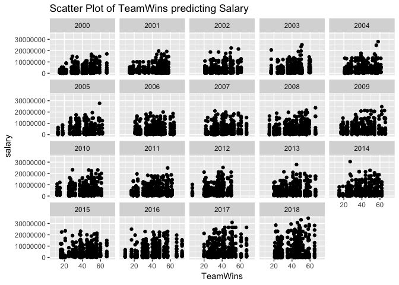
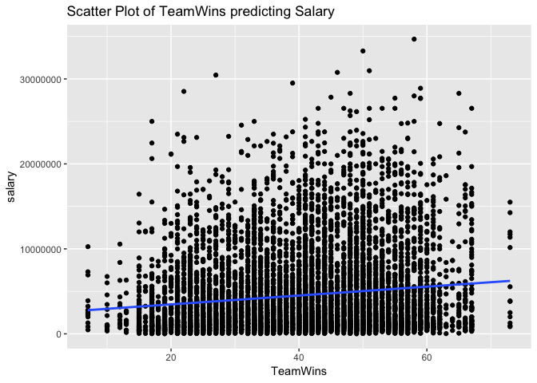
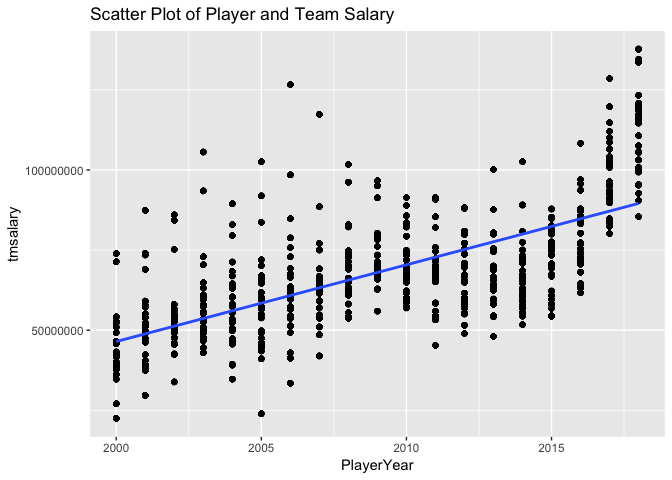
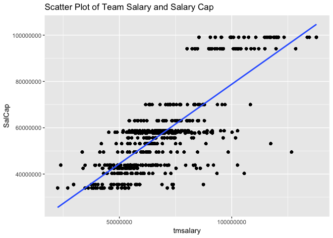

Loaded in the library 

```r
library(dplyr)
library(ggplot2)
library(ggrepel)
library(directlabels)
library(gridExtra)
options(max.print = 999999999)
options(scipen=12)
```

Loaded in the data

```
## [1] "/Users/justinvhuang/Desktop/nba_stat_salaries"
```

```
## [1] "/Users/justinvhuang/Desktop/nba_stat_salaries"
```


Looked at the data


```r
glimpse(data)
head(data)
names(data)
summary(data)
str(data)
```

Exploring the different correlation among NBA Data 


```r
cor(data[, sapply(data, is.numeric)],
    use = "complete.obs", method = "pearson")
```

##Visulizaing and performing linear and multiple linear regression anaylsis 

###Team wins and salary
<!-- --><!-- -->

```
##      N mean(TeamWins) sd(TeamWins) mean(salary) sd(salary)
## 1 7978       40.25783      12.4921      4523495    4862128
##   cor(TeamWins, salary)
## 1             0.1340312
```

There doesn't seem to be any correlation or a strong correlation with team wins and salary at all.  The correlation is really low at 0.134.  Also the standard deviation is higher than the mean for the salry.  I think the reasoning behind this is that since teams have to fill in a cap every year they might sign players to big contracts but this might not equate to wins.  


```
## 
## Call:
## lm(formula = salary ~ TeamWins, data = data)
## 
## Coefficients:
## (Intercept)     TeamWins  
##     2423361        52167
```

```
## 
## Call:
## lm(formula = salary ~ TeamWins, data = data)
## 
## Residuals:
##      Min       1Q   Median       3Q      Max 
## -5736973 -3288422 -1748048  1628075 29233497 
## 
## Coefficients:
##             Estimate Std. Error t value Pr(>|t|)    
## (Intercept)  2423360     182042   13.31   <2e-16 ***
## TeamWins       52167       4319   12.08   <2e-16 ***
## ---
## Signif. codes:  0 '***' 0.001 '**' 0.01 '*' 0.05 '.' 0.1 ' ' 1
## 
## Residual standard error: 4819000 on 7976 degrees of freedom
## Multiple R-squared:  0.01796,	Adjusted R-squared:  0.01784 
## F-statistic: 145.9 on 1 and 7976 DF,  p-value: < 0.00000000000000022
```

```
##               Estimate Std. Error  t value     Pr(>|t|)
## (Intercept) 2423360.54  182042.31 13.31207 5.252301e-40
## TeamWins      52167.11    4318.79 12.07910 2.656988e-33
```

```
## Analysis of Variance Table
## 
## Response: salary
##             Df             Sum Sq          Mean Sq F value
## TeamWins     1   3387691441857934 3387691441857934   145.9
## Residuals 7976 185190875343491680   23218514962825        
##                          Pr(>F)    
## TeamWins  < 0.00000000000000022 ***
## Residuals                          
## ---
## Signif. codes:  0 '***' 0.001 '**' 0.01 '*' 0.05 '.' 0.1 ' ' 1
```

RMSE


```
## [1] 4817955
```

Team wins loooks to be significant with a low P value and high F stat.  However the Adjusted R squared is really low  at 0.01784.  RMSE is high but relative to the mean salary not to bad. 


Player Year and Team salary

<!-- -->

```
##      N mean(PlayerYear) sd(PlayerYear) mean(tmsalary) sd(tmsalary)
## 1 7978         2009.259       5.522936       68631878     19548174
##   cor(PlayerYear, tmsalary)
## 1                  0.676354
```

There is a strong correlation of 0.676 with Player year and team salary.  And this is evidence so far since the new CBA agreement and the increase in team salary over the years.  


```
## 
## Call:
## lm(formula = tmsalary ~ PlayerYear, data = data)
## 
## Coefficients:
## (Intercept)   PlayerYear  
## -4741380360      2393923
```

```
## 
## Call:
## lm(formula = tmsalary ~ PlayerYear, data = data)
## 
## Residuals:
##       Min        1Q    Median        3Q       Max 
## -34513671  -8789457  -1210897   6181369  65800926 
## 
## Coefficients:
##                Estimate  Std. Error t value Pr(>|t|)    
## (Intercept) -4741380360    58654209  -80.84   <2e-16 ***
## PlayerYear      2393924       29192   82.01   <2e-16 ***
## ---
## Signif. codes:  0 '***' 0.001 '**' 0.01 '*' 0.05 '.' 0.1 ' ' 1
## 
## Residual standard error: 14400000 on 7976 degrees of freedom
## Multiple R-squared:  0.4575,	Adjusted R-squared:  0.4574 
## F-statistic:  6725 on 1 and 7976 DF,  p-value: < 0.00000000000000022
```

```
##                Estimate  Std. Error   t value Pr(>|t|)
## (Intercept) -4741380360 58654209.13 -80.83615        0
## PlayerYear      2393923    29191.85  82.00657        0
```

```
## Analysis of Variance Table
## 
## Response: tmsalary
##              Df              Sum Sq             Mean Sq F value
## PlayerYear    1 1394440856453875968 1394440856453875968  6725.1
## Residuals  7976 1653818962557982208     207349418575474        
##                           Pr(>F)    
## PlayerYear < 0.00000000000000022 ***
## Residuals                           
## ---
## Signif. codes:  0 '***' 0.001 '**' 0.01 '*' 0.05 '.' 0.1 ' ' 1
```

RMSE


```
## [1] 14397828
```

High F Stat and adjusted R squared is 0.4574 which is pretty good.  Also a low p value showing that the findings are significant.  

Team Salary and Salary Cap 

<!-- -->

```
##      N mean(tmsalary) sd(tmsalary) mean(SalCap) sd(SalCap)
## 1 7978       68631878     19548174     57251838   17055247
##   cor(tmsalary, SalCap)
## 1             0.7865825
```

There is a high correlation with team salary and salary cap as expected. Which is 0.787 rounded. 


```
## 
## Call:
## lm(formula = tmsalary ~ SalCap, data = data)
## 
## Coefficients:
##   (Intercept)         SalCap  
## 17016170.4879         0.9016
```

```
## 
## Call:
## lm(formula = tmsalary ~ SalCap, data = data)
## 
## Residuals:
##       Min        1Q    Median        3Q       Max 
## -32644831  -7392135  -1213489   5240279  64987931 
## 
## Coefficients:
##                    Estimate      Std. Error t value Pr(>|t|)    
## (Intercept) 17016170.487907   473404.292552   35.94   <2e-16 ***
## SalCap             0.901555        0.007925  113.77   <2e-16 ***
## ---
## Signif. codes:  0 '***' 0.001 '**' 0.01 '*' 0.05 '.' 0.1 ' ' 1
## 
## Residual standard error: 12070000 on 7976 degrees of freedom
## Multiple R-squared:  0.6187,	Adjusted R-squared:  0.6187 
## F-statistic: 1.294e+04 on 1 and 7976 DF,  p-value: < 0.00000000000000022
```

```
##                     Estimate       Std. Error   t value      Pr(>|t|)
## (Intercept) 17016170.4879073 473404.292552476  35.94427 2.286938e-262
## SalCap             0.9015555      0.007924688 113.76542  0.000000e+00
```

```
## Analysis of Variance Table
## 
## Response: tmsalary
##             Df              Sum Sq             Mean Sq F value
## SalCap       1 1885994986961050112 1885994986961050112   12943
## Residuals 7976 1162264832050757376     145720264800747        
##                          Pr(>F)    
## SalCap    < 0.00000000000000022 ***
## Residuals                          
## ---
## Signif. codes:  0 '***' 0.001 '**' 0.01 '*' 0.05 '.' 0.1 ' ' 1
```

```
## [1] 1162264832050757376
```

```
## [1] 12069952
```


Multiple Linear Regression Analysis


```
## [1] 0.300164
```

```
## [1] 0.4771755
```

```
## [1] 0.511282
```

```
## [1] 0.5902752
```

```
## [1] 0.5904286
```

```
## [1] 0.4869515
```

```
## [1] 0.2761971
```

```
## [1] 0.5604341
```

```
## [1] 0.3932086
```

```
## [1] 0.2923957
```

```
## [1] 0.3657247
```

```
## [1] 0.1903598
```

```
## [1] 0.4233146
```


```
## 
## Call:
## lm(formula = salary ~ Age + t_reb + TO + ppg + FG + started + 
##     three + two + assist + block, data = data, subset = +steal + 
##     EFG + NumYears)
## 
## Coefficients:
## (Intercept)          Age        t_reb           TO          ppg  
##    -5239935       197200        61568       705855      1655890  
##          FG      started        three          two       assist  
##    -2484691       -10019     -3508226     -1131077         7192  
##       block  
##     1710857
```

```
## 
## Call:
## lm(formula = salary ~ Age + t_reb + TO + ppg + FG + started + 
##     three + two + assist + block, data = data, subset = +steal + 
##     EFG + NumYears)
## 
## Residuals:
##      Min       1Q   Median       3Q      Max 
## -1891071  -748458   164797   459419  3079758 
## 
## Coefficients:
##               Estimate Std. Error t value          Pr(>|t|)    
## (Intercept) -5239934.9   126672.6 -41.366           < 2e-16 ***
## Age           197200.4     5763.1  34.218           < 2e-16 ***
## t_reb          61568.3    12258.2   5.023 0.000000520791913 ***
## TO            705854.6    95449.1   7.395 0.000000000000156 ***
## ppg          1655890.3    25637.4  64.589           < 2e-16 ***
## FG          -2484691.0   291813.1  -8.515           < 2e-16 ***
## started       -10019.5      629.3 -15.921           < 2e-16 ***
## three       -3508226.0   260947.8 -13.444           < 2e-16 ***
## two         -1131077.1   266445.9  -4.245 0.000022102132472 ***
## assist          7191.8    24783.8   0.290             0.772    
## block        1710857.1    38982.6  43.888           < 2e-16 ***
## ---
## Signif. codes:  0 '***' 0.001 '**' 0.01 '*' 0.05 '.' 0.1 ' ' 1
## 
## Residual standard error: 826800 on 7967 degrees of freedom
## Multiple R-squared:  0.9117,	Adjusted R-squared:  0.9116 
## F-statistic:  8228 on 10 and 7967 DF,  p-value: < 0.00000000000000022
```

```
##                 Estimate  Std. Error     t value      Pr(>|t|)
## (Intercept) -5239934.852 126672.6351 -41.3659576  0.000000e+00
## Age           197200.415   5763.0814  34.2178779 1.514667e-239
## t_reb          61568.269  12258.2061   5.0226166  5.207919e-07
## TO            705854.593  95449.1347   7.3950863  1.556817e-13
## ppg          1655890.288  25637.3569  64.5889627  0.000000e+00
## FG          -2484691.033 291813.0784  -8.5146665  1.977214e-17
## started       -10019.476    629.3412 -15.9205792  3.336273e-56
## three       -3508225.958 260947.8496 -13.4441650  9.248692e-41
## two         -1131077.115 266445.9236  -4.2450532  2.210213e-05
## assist          7191.838  24783.8135   0.2901829  7.716839e-01
## block        1710857.145  38982.5912  43.8877225  0.000000e+00
```

```
## Analysis of Variance Table
## 
## Response: salary
##             Df            Sum Sq           Mean Sq    F value
## Age          1 26617670265650752 26617670265650752 38942.2089
## t_reb        1 23207920338807256 23207920338807256 33953.6734
## TO           1   312133479687224   312133479687224   456.6578
## ppg          1   635494801495760   635494801495760   929.7422
## FG           1  1281797013187973  1281797013187973  1875.2959
## started      1       53881268957       53881268957     0.0788
## three        1  2717511487738539  2717511487738539  3975.7762
## two          1     9474641352059     9474641352059    13.8616
## assist       1   140019277476640   140019277476640   204.8511
## block        1  1316544509131795  1316544509131795  1926.1322
## Residuals 7967  5445581668074796      683517217030           
##                          Pr(>F)    
## Age       < 0.00000000000000022 ***
## t_reb     < 0.00000000000000022 ***
## TO        < 0.00000000000000022 ***
## ppg       < 0.00000000000000022 ***
## FG        < 0.00000000000000022 ***
## started               0.7788973    
## three     < 0.00000000000000022 ***
## two                   0.0001981 ***
## assist    < 0.00000000000000022 ***
## block     < 0.00000000000000022 ***
## Residuals                          
## ---
## Signif. codes:  0 '***' 0.001 '**' 0.01 '*' 0.05 '.' 0.1 ' ' 1
```

```
## [1] 5445581668074796
```

```
## [1] 826180.8
```


```
## 
## Call:
## lm(formula = salary ~ t_reb + TO + ppg + FG + started + block, 
##     data = data, subset = +steal + NumYears)
## 
## Coefficients:
## (Intercept)        t_reb           TO          ppg           FG  
##     -802311       562192       633838       636539     -1507803  
##     started        block  
##       -9437      1222420
```

```
## 
## Call:
## lm(formula = salary ~ t_reb + TO + ppg + FG + started + block, 
##     data = data, subset = +steal + NumYears)
## 
## Residuals:
##      Min       1Q   Median       3Q      Max 
## -2320857  -631378  -335339   718945  1550191 
## 
## Coefficients:
##               Estimate Std. Error t value Pr(>|t|)    
## (Intercept)  -802311.0    28305.9  -28.34   <2e-16 ***
## t_reb         562191.9     9524.5   59.03   <2e-16 ***
## TO            633837.9    46678.3   13.58   <2e-16 ***
## ppg           636538.7    21541.9   29.55   <2e-16 ***
## FG          -1507803.4    48172.3  -31.30   <2e-16 ***
## started        -9436.8      662.5  -14.24   <2e-16 ***
## block        1222419.9    41471.4   29.48   <2e-16 ***
## ---
## Signif. codes:  0 '***' 0.001 '**' 0.01 '*' 0.05 '.' 0.1 ' ' 1
## 
## Residual standard error: 1031000 on 7971 degrees of freedom
## Multiple R-squared:  0.8715,	Adjusted R-squared:  0.8714 
## F-statistic:  9011 on 6 and 7971 DF,  p-value: < 0.00000000000000022
```

```
##                 Estimate Std. Error   t value      Pr(>|t|)
## (Intercept)  -802311.026 28305.8935 -28.34431 1.803136e-168
## t_reb         562191.871  9524.5346  59.02565  0.000000e+00
## TO            633837.916 46678.2791  13.57886  1.545159e-41
## ppg           636538.728 21541.9032  29.54886 3.449552e-182
## FG          -1507803.444 48172.2508 -31.30025 6.070874e-203
## started        -9436.754   662.4577 -14.24507  1.734605e-45
## block        1222419.853 41471.3903  29.47622 2.388163e-181
```

```
## Analysis of Variance Table
## 
## Response: salary
##             Df            Sum Sq           Mean Sq    F value Pr(>F)    
## t_reb        1 54353561302996880 54353561302996880 51103.0583 <2e-16 ***
## TO           1   276841849333643   276841849333643   260.2859 <2e-16 ***
## ppg          1   534180814988097   534180814988097   502.2352 <2e-16 ***
## FG           1  1415565154757028  1415565154757028  1330.9102 <2e-16 ***
## started      1      100283939956      100283939956     0.0943 0.7588    
## block        1   924112218598520   924112218598520   868.8476 <2e-16 ***
## Residuals 7971  8478009963550667     1063606820167                      
## ---
## Signif. codes:  0 '***' 0.001 '**' 0.01 '*' 0.05 '.' 0.1 ' ' 1
```

```
## [1] 8478009963550667
```

```
## [1] 1030861
```


```
## 
## Call:
## lm(formula = salary ~ t_reb + TO + ppg + FG + Age + started + 
##     three + two + assist + block, data = data, subset = +steal + 
##     NumYears)
## 
## Coefficients:
## (Intercept)        t_reb           TO          ppg           FG  
##  -4924622.4      69609.1     713760.0    1608869.0   -2058458.2  
##         Age      started        three          two       assist  
##    185457.7     -11621.6   -3808624.1   -1421161.9        804.6  
##       block  
##   1714923.3
```

```
## 
## Call:
## lm(formula = salary ~ t_reb + TO + ppg + FG + Age + started + 
##     three + two + assist + block, data = data, subset = +steal + 
##     NumYears)
## 
## Residuals:
##      Min       1Q   Median       3Q      Max 
## -1890342  -719888   143796   410398  1786027 
## 
## Coefficients:
##               Estimate Std. Error t value         Pr(>|t|)    
## (Intercept) -4924622.4   133245.1 -36.959          < 2e-16 ***
## t_reb          69609.1    12584.1   5.532 0.00000003275268 ***
## TO            713760.0   102179.4   6.985 0.00000000000307 ***
## ppg          1608869.0    22628.6  71.099          < 2e-16 ***
## FG          -2058458.2   305883.4  -6.730 0.00000000001820 ***
## Age           185457.7     6119.3  30.307          < 2e-16 ***
## started       -11621.6      594.4 -19.550          < 2e-16 ***
## three       -3808624.1   270022.4 -14.105          < 2e-16 ***
## two         -1421161.9   278863.9  -5.096 0.00000035439981 ***
## assist           804.6    26500.8   0.030            0.976    
## block        1714923.3    36829.5  46.564          < 2e-16 ***
## ---
## Signif. codes:  0 '***' 0.001 '**' 0.01 '*' 0.05 '.' 0.1 ' ' 1
## 
## Residual standard error: 793700 on 7967 degrees of freedom
## Multiple R-squared:  0.9239,	Adjusted R-squared:  0.9238 
## F-statistic:  9678 on 10 and 7967 DF,  p-value: < 0.00000000000000022
```

```
##                 Estimate  Std. Error      t value      Pr(>|t|)
## (Intercept) -4924622.428 133245.1163 -36.95912138 3.988133e-276
## t_reb          69609.116  12584.0843   5.53152018  3.275268e-08
## TO            713759.977 102179.3823   6.98536203  3.069980e-12
## ppg          1608868.968  22628.5502  71.09907422  0.000000e+00
## FG          -2058458.201 305883.3637  -6.72955265  1.819642e-11
## Age           185457.737   6119.2789  30.30712254 4.710360e-191
## started       -11621.556    594.4453 -19.55025298  3.571411e-83
## three       -3808624.079 270022.4458 -14.10484254  1.217956e-44
## two         -1421161.879 278863.9301  -5.09625565  3.543998e-07
## assist           804.633  26500.8058   0.03036258  9.757786e-01
## block        1714923.339  36829.5154  46.56383119  0.000000e+00
```

```
## Analysis of Variance Table
## 
## Response: salary
##             Df            Sum Sq           Mean Sq    F value
## t_reb        1 54353561302996880 54353561302996880 86286.7603
## TO           1   276841849333643   276841849333643   439.4889
## ppg          1   534180814988097   534180814988097   848.0168
## FG           1  1415565154757028  1415565154757028  2247.2222
## Age          1   112491788386099   112491788386099   178.5817
## started      1     5308355928389     5308355928389     8.4271
## three        1  2693009472871446  2693009472871446  4275.1764
## two          1       76949027114       76949027114     0.1222
## assist       1   206999651725117   206999651725117   328.6138
## block        1  1365781587914751  1365781587914751  2168.1904
## Residuals 7967  5018554660236205      629917743220           
##                          Pr(>F)    
## t_reb     < 0.00000000000000022 ***
## TO        < 0.00000000000000022 ***
## ppg       < 0.00000000000000022 ***
## FG        < 0.00000000000000022 ***
## Age       < 0.00000000000000022 ***
## started                0.003707 ** 
## three     < 0.00000000000000022 ***
## two                    0.726716    
## assist    < 0.00000000000000022 ***
## block     < 0.00000000000000022 ***
## Residuals                          
## ---
## Signif. codes:  0 '***' 0.001 '**' 0.01 '*' 0.05 '.' 0.1 ' ' 1
```

```
## [1] 5018554660236205
```

```
## [1] 793126.2
```
