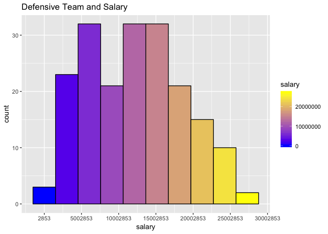
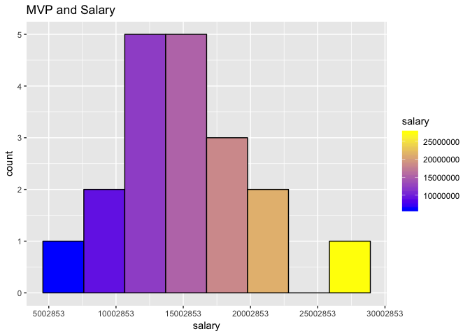

Loaded in the library 

```r
library(dplyr)
library(ggplot2)
library(ggrepel)
library(directlabels)
library(gridExtra)
options(max.print = 999999999)
options(scipen=12)
```

Loaded in the data

```
## [1] "/Users/justinvhuang/Desktop/nba_stat_salaries"
```

```
## [1] "/Users/justinvhuang/Desktop/nba_stat_salaries"
```

##Stastical Analysis 

### Top College schools in America and where are NBA teams placing their money over the last 19 years. 


```
## # A tibble: 11 x 3
##    school         count_school     salary
##    <fct>                 <int>      <dbl>
##  1 None                   1285 7407695183
##  2 Kentucky                261 1220596079
##  3 Duke                    252 1308479631
##  4 North Carolina          241 1182185814
##  5 UCLA                    206  947159451
##  6 Kansas                  194  840093830
##  7 Arizona                 190  995023686
##  8 Connecticut             184 1038212650
##  9 Florida                 143  817700613
## 10 Georgia Tech            129  718884989
## 11 Texas                   116  627431018
```

<!-- -->

The none rows contain international players and players who did not go to college. 

Let us now explore what position was drafted the most.  


```
## # A tibble: 5 x 2
##   Pos   count_pos
##   <fct>     <int>
## 1 PF          177
## 2 SF          158
## 3 SG          154
## 4 C           138
## 5 PG          115
```

The powerforward position was drafted the most from these schools. The most notable and recent one is Anthony Davis. 

Lets now take a look at which team in the NBA drafted the most from these 3 schools 


```
## # A tibble: 10 x 2
##    team  count_team
##    <fct>      <int>
##  1 CHO           46
##  2 LAC           40
##  3 DET           36
##  4 BOS           32
##  5 DAL           32
##  6 WAS           32
##  7 MIL           31
##  8 PHO           31
##  9 CHI           30
## 10 NOP           28
```

Looks like Charlotte and the LA clippers drafted the most from these 3 schools. 

Taking a look at the top paid players from these schools 


```
## # A tibble: 10 x 6
## # Groups:   DraftRound, DraftNum, name, salary [10]
##    DraftRound DraftNum name            salary school      count_draftround
##    <fct>      <fct>    <fct>            <int> <fct>                  <int>
##  1 1          1        Anthony Davis 23775506 Kentucky                   1
##  2 1          7        Harrison Bar… 23112004 North Caro…                1
##  3 1          11       JJ Redick     23000000 Duke                       1
##  4 1          1        Anthony Davis 22116750 Kentucky                   1
##  5 1          7        Harrison Bar… 22116750 North Caro…                1
##  6 1          5        Vince Carter  21300000 North Caro…                1
##  7 1          1        Kyrie Irving  18868626 Duke                       1
##  8 1          1        Elton Brand   18160354 Duke                       1
##  9 1          1        John Wall     18063850 Kentucky                   1
## 10 1          5        DeMarcus Cou… 18063850 Kentucky                   1
```

Anthony Davis, Harrison Barnes and JJ Redick are the top paid players.  While Davis is a superstar player the other two's salaries can be explained by the bump in salary cap and new TV deals coming in the NBA. 

###Looking at trends in the data


```r
cor(data[, sapply(data, is.numeric)],
    use = "complete.obs", method = "pearson")
```

Lets look at some obvious correlations that should make sense with NBA players 

<!-- -->

```
## [1] 0.8303671
```

<!-- -->

```
## [1] 0.5000179
```

So Height and Weight have a positive correlation. PlusMinus is stuck in the middle with some below average players stuck on good teams that win a lot of games as a whole.  Lets look at that outlier of a 60 win team that has a plus minus of more than -20.


```
##               name team salary TeamWins PlusMinus PlayerYear
## 2434    Alex Acker  DET 398762       64     -45.5       2006
## 2576 Jason Maxiell  DET 905640       64     -30.2       2006
```

Huge Negative plus minuses for these two players on a winning team. They could be playing on garbage time minutes when the game is already decided.

Increased minutes should lead to increased scoring. 

<!-- -->

```
## [1] 0.4913905
```

Lets look at the player who made more than 5 3's a game from the plot above. 


```
##   PlayerYear team          name   salary height_cm weight_lb   school
## 1       2016  GSW Stephen Curry 11370786       191       190 Davidson
##   country DraftYear DraftRound DraftNum PlusMinus Pos Age Games started
## 1     USA      2009          1        7      17.7  PG  27    79      79
##   MinGames   FG FG_att three three_att two two_att  FT FT_att o_reb d_reb
## 1     34.2 10.2   20.2   5.1      11.2 5.1       9 4.6    5.1   0.9   4.6
##   t_reb assist steal block  TO fouls  ppg infl mvp mip SixthMan dpoy roy
## 1   5.4    6.7   2.1   0.2 3.3     2 30.1  0.1 YES  NO       NO   NO  NO
##   nba1 nba2 nba3 rook1 rook2 def1 def2    FG_per   two_per       EFG
## 1  YES   NO   NO    NO    NO   NO   NO 0.5049505 0.5666667 0.6311881
##   three_per    FT_per TeamWins NumYears tmsalary   SalCap overUnder
## 1 0.4553571 0.9019608       73        9 93669566 70000000  1.338137
```

This player is Stephen Curry when he broke the 3 point record by a huge margin in one season

<!-- -->

```
## [1] 0.8226616
```

There is more of a positive linear correlation in twos than there are for 3's made.  Perhaps there are role players who specialize in 3 point shooting and play minutes sparringly. 

<!-- -->

```
## [1] 0.300164
```

We can see the maximum earning period for a NBA player is around his early 30's.  


Lets look at an interesting finding.

<!-- -->

```
## [1] 0.511282
```

<!-- -->

```
## [1] 0.5902752
```

<!-- -->

```
## [1] 0.5904286
```

The more FG and PPG a player has should lead to an increase in salary which shows a high correlation.  However, the higher the turnovers also lead to a higher salary.  Let us explore further.

<!-- -->

```
## [1] 0.8117291
```

<!-- -->

```
## [1] 0.8292689
```

We can see players who play more probably Star players who handle the ball more will also have a higher chance of turning the ball over and thus there is a positive correlation between turnover and salary.  

Salary has increased due to the increase in salary cap.

<!-- -->

```
## [1] 0.676354
```

<!-- -->

```
## [1] 0.7865825
```

<!-- -->

```
## [1] 0.8939345
```

The amount of money in the league has been increasing in the league.  This cannot be attributed to just inflation.  This has to be due to the 4 CBAs and the new money coming in from TV deals and the spread of social influence through social media and international expansion. 


Looking at the trend of Twos vs Threes


```
## `geom_smooth()` using method = 'gam' and formula 'y ~ s(x, bs = "cs")'
## `geom_smooth()` using method = 'gam' and formula 'y ~ s(x, bs = "cs")'
```

<!-- -->

There seems to be a trend of more threes than twos as the years progress. 

###Boxplot and Histogram of NBA data 

<!-- -->

Tend to get a higher mean salary for more threes made.

<!-- -->

Higher mean salary for more points scored.  

<!-- -->

Mean EFG for salary does not seem to increase.  More lone spread out points above for salary for star players perhaps. 

<!-- -->

Mean salary increases with more rebounds.  However, small players who aren't getting many rebounds are getting more of a salary as well. 

<!-- -->

Salary seems to increase more during the 2016, 2017 and 2018 season.  

<!-- --><!-- -->

```
## # A tibble: 188 x 3
## # Groups:   salary [?]
##     salary PlayerYear name            
##      <int>      <int> <fct>           
##  1  715850       2002 Bruce Bowen     
##  2  915243       2015 Patrick Beverley
##  3 1471382       2018 Tony Allen      
##  4 1671694       2005 Andrei Kirilenko
##  5 1763115       2006 Tayshaun Prince 
##  6 2094922       2010 Rajon Rondo     
##  7 2119214       2015 Jimmy Butler    
##  8 2253061       2013 Serge Ibaka     
##  9 2500000       2000 Eddie Jones     
## 10 2511432       2014 Avery Bradley   
## # ... with 178 more rows
```

<!-- --><!-- --><!-- -->

Defensive player of the year seems to be more concentrated in the center.  The other Award categories are more spread out but still have more players in the center rather at the ends of the histogram. 

###density plot of the data

<!-- -->

Threes are right skewed as expected since the best players take and make the most shots. 

<!-- -->

PlusMinus is more normal for the distribution. 

<!-- -->

Two point scored is right skewed as well but not as right skewed as threepoint shots.  It would be interesting to split the range of the two point shot from 2 ft and 15ft etc...

<!-- -->

Salary distribution is right skewed as expected since the best players take the most money from the team.  This is due to how the contracts are strucured where players who sign for the max take 25 percent to 40 percent of the teams salary. 

<!-- -->
<!-- -->

Total rebounds and PPG are also right skewed as more talented players or top players will score or grab more rebounds. 

<!-- -->

EFG looks to be normally distributed as it calculateds the effective field goal percentage for scoring stats.

<!-- --><!-- --><!-- -->

The distribution for defensive player of the year looks interesting as there seems to be a second hump forming for the density plot.

<!-- --><!-- --><!-- --><!-- --><!-- -->


All the plots are right skewed.  Round 2 is the most right skewed as its hard to find really gems in the second round who will be star players and command a higher salary. 
